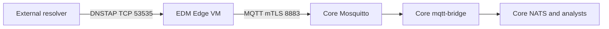

# DNS TAPIR Edge DNSTAP receiver test deployment

**Updated:** 2026-09-03  
**Edge target:** one Ubuntu 24.04 LTS VM  
**Resolver:** a separate host that sends DNSTAP over TCP  
**Core:** the VM installed by the DNS TAPIR Core runbook

## 1. Scope and topology

This guide installs an Edge on a dedicated VM: EDM and TAPIR-POP. EDM listens
for an unencrypted DNSTAP stream from a resolver on TCP 53535, minimises the
data, signs each new-qname event, and sends it to the Core broker over
mutual-TLS MQTT on TCP 8883. POP subscribes to the observations Core sends back,
applies local policy, and compiles them into a single RPZ zone. The resolver
remains outside the Edge VM.

The two directions matter equally. EDM alone proves only that data leaves the
Edge; POP is what closes the loop, and it is how DNS TAPIR's own looptest
verifies a complete round-trip.

The Core runbook must already have completed Sections 11 and 12. Those sections
install NATS, NodeMan, Mosquitto, and `mqtt-bridge`; this Edge guide does not
install Core services.



NodeMan enrollment creates two independent Edge identities:

- a long-lived Ed25519 JWK used by EDM to sign event payloads;
- a short-lived X.509 certificate and private key used to authenticate the
  Edge to Mosquitto while TLS encrypts the MQTT connection.

The Core `mqtt-bridge` retrieves the enrolled public JWK from NodeMan and
rejects messages with an invalid signature. This is a private test deployment:
NodeMan enrollment and renewal use HTTP on TCP 8080, while MQTT itself is
encrypted and client-authenticated.

All privileged setup is in one script next to this runbook,
`dnstapir-host-bootstrap.sh`, which Section 3 invokes. The Core runbook uses the
same script with different arguments, so the two hosts are bootstrapped
identically. Every step after Section 3 runs unprivileged, except the sections
explicitly labelled `[edge-admin]`, `[core-service]`, or `[resolver-admin]`.

### This is not a production Edge

This runbook builds an Edge by hand to exercise EDM against a Core installed by
the companion runbook. A production Edge is installed a different way, and this
guide should not be used as a template for one.

The aggregate path is enabled here. EDM sends two kinds of data to Core: a
`new_qname` event over MQTT for a name it has not seen, and an aggregated
histogram over signed HTTP for names that match the well-known-domains filter.
The filter decides which path a name takes, so both it and the Aggregate
Receiver have to be real for either half to mean anything.

`--http-signing-key-file` is the node's enrolled `data.json`. Despite the flag
help calling it an ECDSA key, EDM loads it as an EdDSA JWK and exports an
Ed25519 private key from it, and the Aggregate Receiver verifies the signature
by fetching the matching public key from NodeMan. So an enrolled node can upload
with no additional key material.

Officially, an Edge is installed from operating-system packages managed by
systemd, not from containers:
[`dnstapir-pop`](https://dnstapir.github.io/techdocs/tapir-pop.html) for the
policy processor, `dnstapir-edm` for the minimiser, `dnstapir-renew` for
automatic certificate renewal on a systemd timer, and `dnstapir-reloader` to
`SIGHUP` EDM after a renewal. A production Edge sends aggregates to the Aggregate Receiver over HTTPS; this
runbook sends them over plain HTTP on the test network, but does exercise the
path — EDM's histogram sender is enabled and Core runs the Aggregate Receiver.

There is also an official container stack,
[`dnstapir/edge-stack`](https://github.com/dnstapir/edge-stack), which bundles
the resolver alongside EDM and points at hosted Core infrastructure. It is a
better starting point than this runbook for anyone who wants Edge in containers,
and it avoids the external-resolver plumbing in Section 12 entirely.

Two further reasons not to copy this guide into production: EDM and POP are
built from source here, for the reasons given below, rather than installed from
packages or published images; and the Crypto-PAn key, the DAWG file, and the
node names are all throwaway test values.

POP is installed in Section 11 but with no downstream resolver configured, so it
compiles the RPZ zone and serves it to nobody. Section 12 adds the resolver that
consumes it.

For a real deployment, start from the official documentation instead:

- [Edge installation](https://dnstapir.github.io/techdocs/installation.html)
  and [post-install](https://dnstapir.github.io/techdocs/postinstall.html)
- [Onboarding](https://dnstapir.github.io/techdocs/onboarding.html), which
  covers obtaining credentials from a Core operator
- [`dnstapir/edge-stack`](https://github.com/dnstapir/edge-stack) for the
  official container stack
- [DNS TAPIR technical documentation](https://dnstapir.github.io/techdocs)

## 2. Accounts, variables, and checklist

| Label | Account | Work |
|---|---|---|
| `[edge-admin]` | Existing Edge VM administrator with `sudo` | Install OS packages, create the Edge account, configure Rootless Docker, install the enrollment file, and set the firewall rule |
| `[edge-service]` | `dnstapir`, no `sudo`, not in `docker` group | Own EDM, run Rootless Docker, enroll with NodeMan, and operate the Edge |
| `[core-service]` | Existing Core `dnstapir` account | Create the one-time enrollment file and inspect Core services |
| `[resolver-admin]` | External resolver administrator | Configure the resolver to send DNSTAP to the Edge VM |

The examples use documentation addresses. As `[edge-admin]`, replace them with
the fixed addresses on the test network, then set every convenience variable
before using it:

```bash
export TAPIR_EDGE_VM_IP=192.0.2.21
export TAPIR_RESOLVER_IP=192.0.2.53
export TAPIR_CORE_VM_IP=192.0.2.10

export TAPIR_EDGE_SERVICE_USER=dnstapir
export TAPIR_EDGE_ID=edge-receiver-01.edge.test
export TAPIR_EDGE_ROOT=/opt/dnstapir-edge
export TAPIR_EDGE_SRC="$TAPIR_EDGE_ROOT/src"
export TAPIR_EDGE_CONFIG="$TAPIR_EDGE_ROOT/config"
export TAPIR_EDGE_KEYS="$TAPIR_EDGE_ROOT/keys"
export TAPIR_EDGE_BIN="$TAPIR_EDGE_ROOT/bin"
export TAPIR_EDGE_RUN="$TAPIR_EDGE_ROOT/run"
export TAPIR_EDGE_LOGS="$TAPIR_EDGE_ROOT/logs"
export TAPIR_EDGE_TOOLS_VENV="$TAPIR_EDGE_ROOT/tools-venv"
export TAPIR_EDGE_UV="$TAPIR_EDGE_TOOLS_VENV/bin/uv"
export TAPIR_EDGE_DNSTAP_PORT=53535
export TAPIR_CORE_NODEMAN_PORT=8080
export TAPIR_CORE_MQTT_PORT=8883
export TAPIR_CORE_AGGREC_PORT=8090
export TAPIR_EDM_IMAGE=edm:edge-runtime
```

`TAPIR_EDM_IMAGE` names a local image that Section 6 builds from the `edm`
source tree. The published image cannot be used for this guide:

- the obvious name, `ghcr.io/dnstapir/edm:latest`, does not exist. The `edm`
  release workflow runs
  `ko build --base-import-paths github.com/dnstapir/edm/cmd/dnstapir-edm`, and
  `setup-ko` defaults `KO_DOCKER_REPO` to `ghcr.io/<owner>/<repo>`, so the
  published name is `ghcr.io/dnstapir/edm/dnstapir-edm`. Pulling the old name
  fails with `error from registry: denied`, which GHCR returns for a missing
  package as well as a private one;
- that published image also lags `main` by design. The `edm` container workflow
  is triggered manually, on `workflow_dispatch` or a published release, so
  `latest` moves only when a maintainer builds it and must not be assumed to
  track the default branch. The `latest` tag available while this runbook was
  validated was built from a commit that predates the `-metrics-listen-addr`
  option this guide depends on, so EDM rejected the whole command line and
  printed its usage text instead of starting. Setting the option through
  `-config-file` fails too, because the TOML reader is strict and reports
  `unknown field`.

Building from source pins EDM to a commit recorded in
`$TAPIR_EDGE_LOGS/source-versions.txt` and matches how the Core guide builds its
own persistent `nodeman` and `mqtt-bridge` images. It also removes the need to
reason about how old the published tag is. If a published image known to contain
the `-metrics-listen-addr` option is available, `TAPIR_EDM_IMAGE` can instead be
pointed at `ghcr.io/dnstapir/edm/dnstapir-edm:<tag>` and the Section 6 build
step skipped; check the image's reported version before relying on it.

Check the values and host:

```bash
printf 'Edge=%s Resolver=%s Core=%s Edge-ID=%s\n' \
  "$TAPIR_EDGE_VM_IP" \
  "$TAPIR_RESOLVER_IP" \
  "$TAPIR_CORE_VM_IP" \
  "$TAPIR_EDGE_ID"
cat /etc/os-release
uname -m
free -h
df -h /
ip -brief address
sudo ss -lntp | grep -E ':(2112|53535)\b' || true
```

Checklist:

- [ ] Edge VM has Ubuntu 24.04 LTS, 2 vCPU, 4 GiB RAM, and 20 GiB free disk.
- [ ] The three address variables contain real fixed addresses.
- [ ] `TAPIR_EDGE_ID` is unique and ends in `.edge.test`.
- [ ] `dnstapir` is available as the Edge service account name.
- [ ] Resolver-to-Edge TCP 53535 is routable.
- [ ] Edge-to-Core TCP 8080, 8883 and 8090 are routable.
- [ ] Core runbook Sections 11 and 12 are complete.
- [ ] Edge can reach GitHub, GHCR, Docker Hub, and Ubuntu repositories.
- [ ] `nf_tables` is loaded, so the Rootless Docker setup tool can install.
- [ ] `python3 -c 'import ensurepip'` succeeds, so the tools venv can be created.

## 3. Bootstrap the host as `[edge-admin]`

`dnstapir-host-bootstrap.sh` installs the operating-system and Docker packages,
removes the distribution Docker packages that conflict with Docker's own, loads
`nf_tables`, creates the `dnstapir` service account with its subordinate ID
ranges, installs the Rootless Docker prerequisites, creates the Edge directory
layout, writes the service account's login environment, and hands the Docker
daemon over to that account.

The script is idempotent, so it is safe to re-run after a partial failure. Read
`--help` for the full option list, and add `--dry-run` to see what a given
invocation would do without changing anything.

Loading `nf_tables` is not optional. `iptables` on Ubuntu 24.04 is the
`iptables-nft` front end, so the `iptables` probe in
`dockerd-rootless-setuptool.sh` needs that module, and on a host where no
privileged process has already loaded it the tool refuses to install with
`[ERROR] Missing system requirements`. The script loads it and makes the load
persistent.

The variables set in Section 2 supply the values, so run this from the same
shell:

```bash
sudo ./dnstapir-host-bootstrap.sh \
  --service-user "$TAPIR_EDGE_SERVICE_USER" \
  --subid-start 362144 \
  --extra-packages 'fuse-overlayfs netcat-openbsd' \
  --dir "0755:$TAPIR_EDGE_ROOT" \
  --dir "0755:$TAPIR_EDGE_SRC" \
  --dir "0755:$TAPIR_EDGE_CONFIG" \
  --dir "0755:$TAPIR_EDGE_BIN" \
  --dir "0755:$TAPIR_EDGE_RUN" \
  --dir "0755:$TAPIR_EDGE_LOGS" \
  --dir "0700:$TAPIR_EDGE_KEYS" \
  --env-file .dnstapir-edge-env <<EOF
TAPIR_EDGE_VM_IP=$TAPIR_EDGE_VM_IP
TAPIR_RESOLVER_IP=$TAPIR_RESOLVER_IP
TAPIR_CORE_VM_IP=$TAPIR_CORE_VM_IP
TAPIR_EDGE_SERVICE_USER=$TAPIR_EDGE_SERVICE_USER
TAPIR_EDGE_ID=$TAPIR_EDGE_ID
TAPIR_EDGE_ROOT=$TAPIR_EDGE_ROOT
TAPIR_EDGE_SRC=$TAPIR_EDGE_SRC
TAPIR_EDGE_CONFIG=$TAPIR_EDGE_CONFIG
TAPIR_EDGE_KEYS=$TAPIR_EDGE_KEYS
TAPIR_EDGE_BIN=$TAPIR_EDGE_BIN
TAPIR_EDGE_RUN=$TAPIR_EDGE_RUN
TAPIR_EDGE_LOGS=$TAPIR_EDGE_LOGS
TAPIR_EDGE_TOOLS_VENV=$TAPIR_EDGE_TOOLS_VENV
TAPIR_EDGE_UV=$TAPIR_EDGE_UV
TAPIR_EDGE_DNSTAP_PORT=$TAPIR_EDGE_DNSTAP_PORT
TAPIR_CORE_NODEMAN_PORT=$TAPIR_CORE_NODEMAN_PORT
TAPIR_CORE_MQTT_PORT=$TAPIR_CORE_MQTT_PORT
TAPIR_CORE_AGGREC_PORT=$TAPIR_CORE_AGGREC_PORT
TAPIR_EDM_IMAGE=$TAPIR_EDM_IMAGE
EOF
```

The heredoc is expanded by the administrator's shell, so the login environment
receives the values set in Section 2. `TAPIR_EDGE_SERVICE_UID`,
`XDG_RUNTIME_DIR`, `DBUS_SESSION_BUS_ADDRESS` and `DOCKER_HOST` are appended by
the script, because they depend on the service account's UID.

`--subid-start 362144` keeps this host's subordinate ID range clear of the one
the Core runbook allocates, which matters only if both roles ever share a host.

Do not add the service account to the `docker` group. Membership of that group
is equivalent to root, and the script refuses to continue if the account is in
it.

## 4. Verify the host bootstrap as `[edge-admin]`

```bash
docker --version
docker compose version
command -v dockerd-rootless-setuptool.sh
lsmod | grep -c '^nf_tables' >/dev/null
python3 -c 'import ensurepip'
command -v newuidmap
command -v newgidmap
command -v slirp4netns
id "$TAPIR_EDGE_SERVICE_USER"
id -nG "$TAPIR_EDGE_SERVICE_USER" \
  | tr ' ' '\n' \
  | grep -E '^(sudo|docker)$' || true
grep "^${TAPIR_EDGE_SERVICE_USER}:" /etc/subuid
grep "^${TAPIR_EDGE_SERVICE_USER}:" /etc/subgid
systemctl is-enabled docker.service || true
ls -ld "$TAPIR_EDGE_KEYS"
```

The `id -nG` command must produce no output, `systemctl is-enabled
docker.service` must report `disabled`, and `$TAPIR_EDGE_KEYS` must be mode
`0700` and owned by the service account.

## 5. Enter the service account as `[edge-service]`

Every command from this point on runs as the service account without `sudo`,
except where a section is explicitly labelled `[edge-admin]`,
`[core-service]`, or `[resolver-admin]`.

```bash
sudo -iu "$TAPIR_EDGE_SERVICE_USER"
```

```bash
test "$(id -un)" = "$TAPIR_EDGE_SERVICE_USER"
test -z "$(id -nG | tr ' ' '\n' | grep -E '^(sudo|docker)$' || true)"
systemctl --user is-active docker.service
docker context use rootless
docker info --format '{{json .SecurityOptions}}' | grep -c rootless >/dev/null
docker compose version
docker run --rm hello-world
```

## 6. Fetch tools and create the non-secret EDM data as `[edge-service]`

This section is independent of enrollment. It clones the source used by this
guide, installs the NodeMan client, builds the DAWG utility, creates a small
test DAWG, writes the EDM anonymisation configuration, and builds the EDM image.

The first block below runs under `set -euo pipefail` and mixes two independent
toolchains: the Python virtual environment used only for enrollment, and the
Go and Docker steps that produce the CLI binary, the DAWG file, and the EDM
configuration. A missing `python3-venv` therefore aborts the block before any of
the Docker work runs, with
`ensurepip is not available ... you need to install the python3-venv package`.
Section 4 checks for it; confirm it again here if that section was skipped:

```bash
python3 -c 'import ensurepip'
command -v pip3
```

```bash
set -euo pipefail

TAPIR_EDM_SOURCE="$TAPIR_EDGE_SRC/edm"
TAPIR_CLI_SOURCE="$TAPIR_EDGE_SRC/cli"
TAPIR_NODEMAN_SOURCE="$TAPIR_EDGE_SRC/nodeman"
TAPIR_NODEMAN_CLIENT_SOURCE="$TAPIR_NODEMAN_SOURCE/nodeman/client.py"
TAPIR_NODEMAN_ALG_PATCH_LOG="$TAPIR_EDGE_LOGS/nodeman-client-jwk-alg.patch"
TAPIR_CLI_BINARY="$TAPIR_EDGE_BIN/dnstapir-cli"
TAPIR_DAWG_SOURCE="$TAPIR_EDGE_CONFIG/well-known-domains.csv"
TAPIR_DAWG_FILE="$TAPIR_EDGE_CONFIG/well-known-domains.dawg"
TAPIR_DAWG_URL="https://public.test.dnstapir.se/well-known-domains.dawg"
TAPIR_DAWG_MD5=a99b0adaa5ea091015b9f5bdc5951302
TAPIR_EDM_CONFIG_FILE="$TAPIR_EDGE_CONFIG/edm.toml"
TAPIR_EDGE_VERSION_FILE="$TAPIR_EDGE_LOGS/source-versions.txt"

test "$(id -un)" = "$TAPIR_EDGE_SERVICE_USER"
mkdir -p \
  "$TAPIR_EDGE_SRC" \
  "$TAPIR_EDGE_CONFIG" \
  "$TAPIR_EDGE_BIN" \
  "$TAPIR_EDGE_LOGS"

if [ ! -d "$TAPIR_EDM_SOURCE/.git" ]; then
  git clone https://github.com/dnstapir/edm.git "$TAPIR_EDM_SOURCE"
fi
if [ ! -d "$TAPIR_CLI_SOURCE/.git" ]; then
  git clone https://github.com/dnstapir/cli.git "$TAPIR_CLI_SOURCE"
fi
if [ ! -d "$TAPIR_NODEMAN_SOURCE/.git" ]; then
  git clone https://github.com/dnstapir/nodeman.git "$TAPIR_NODEMAN_SOURCE"
fi

# The current client omits `alg` from the signing JWK. Add it before
# enrollment so EDM can select EdDSA and NodeMan stores the same metadata
# for mqtt-bridge.
test -r "$TAPIR_NODEMAN_CLIENT_SOURCE"
if ! grep -Fq 'data_key["alg"] = jwk_to_alg(data_key)' \
  "$TAPIR_NODEMAN_CLIENT_SOURCE"; then
  sed -i \
    '/^    data_key = JWK.generate(kty=args.kty, crv=args.crv, kid=name)$/a\    data_key["alg"] = jwk_to_alg(data_key)' \
    "$TAPIR_NODEMAN_CLIENT_SOURCE"
fi
grep -Fq 'data_key["alg"] = jwk_to_alg(data_key)' \
  "$TAPIR_NODEMAN_CLIENT_SOURCE"
git -C "$TAPIR_NODEMAN_SOURCE" diff --check
if git -C "$TAPIR_NODEMAN_SOURCE" diff --quiet -- nodeman/client.py; then
  printf '%s\n' \
    'NodeMan already sets the signing JWK algorithm; no local patch was needed.' \
    > "$TAPIR_NODEMAN_ALG_PATCH_LOG"
else
  git -C "$TAPIR_NODEMAN_SOURCE" diff -- nodeman/client.py \
    > "$TAPIR_NODEMAN_ALG_PATCH_LOG"
fi
test -s "$TAPIR_NODEMAN_ALG_PATCH_LOG"

if [ ! -x "$TAPIR_EDGE_UV" ]; then
  python3 -m venv "$TAPIR_EDGE_TOOLS_VENV"
  "$TAPIR_EDGE_TOOLS_VENV/bin/python" -m pip install --upgrade pip
  "$TAPIR_EDGE_TOOLS_VENV/bin/python" -m pip install uv
fi

cd "$TAPIR_NODEMAN_SOURCE"
"$TAPIR_EDGE_UV" sync
test -x "$TAPIR_NODEMAN_SOURCE/.venv/bin/nodeman_client"

docker pull golang:latest
docker run --rm \
  --env GOCACHE=/tmp/go-build \
  --env GOMODCACHE=/tmp/go-mod \
  --volume "$TAPIR_CLI_SOURCE:/src:ro" \
  --volume "$TAPIR_EDGE_BIN:/out" \
  --workdir /src \
  golang:latest \
  sh -c 'CGO_ENABLED=0 go build -buildvcs=false -o /out/dnstapir-cli .'
test -s "$TAPIR_CLI_BINARY"
chmod 0755 "$TAPIR_CLI_BINARY"

printf '%s\n' \
  '1,example.com' \
  '2,example.net' \
  '3,example.org' \
  > "$TAPIR_DAWG_SOURCE"

# The published filter, not a hand-made stub. The DAWG decides which of the two
# processing paths a name takes: a match goes to aggregate (histogram)
# processing, a miss goes to qualitative (new_qname) processing. A stub filter
# therefore sends practically everything down the event path, which is not how
# a real Edge behaves.
if [ ! -s "$TAPIR_DAWG_FILE" ]; then
  curl --fail --silent --show-error --location \
    --output "$TAPIR_DAWG_FILE.download" \
    "$TAPIR_DAWG_URL"
  TAPIR_DAWG_GOT="$(md5sum "$TAPIR_DAWG_FILE.download" | cut -d' ' -f1)"
  if [ "$TAPIR_DAWG_GOT" != "$TAPIR_DAWG_MD5" ]; then
    printf 'well-known-domains.dawg digest %s, expected %s\n' \
      "$TAPIR_DAWG_GOT" "$TAPIR_DAWG_MD5" >&2
    printf 'Check the current digest in the DNS TAPIR postinstall documentation.\n' >&2
    rm -f "$TAPIR_DAWG_FILE.download"
    false
  fi
  mv "$TAPIR_DAWG_FILE.download" "$TAPIR_DAWG_FILE"
fi
test -s "$TAPIR_DAWG_FILE"
printf 'DAWG %s bytes, md5 %s\n' \
  "$(stat -c %s "$TAPIR_DAWG_FILE")" \
  "$(md5sum "$TAPIR_DAWG_FILE" | cut -d' ' -f1)"

# The CSV above stays as the worked example for dnstapir-cli dawg compile; it
# is not what EDM loads.

TAPIR_CRYPTOPAN_KEY="$(openssl rand -hex 32)"
printf 'cryptopan-key = "%s"\n' "$TAPIR_CRYPTOPAN_KEY" \
  > "$TAPIR_EDM_CONFIG_FILE"
chmod 0600 "$TAPIR_EDM_CONFIG_FILE"
grep -q '^cryptopan-key = "[0-9a-f]\{64\}"$' "$TAPIR_EDM_CONFIG_FILE"

{
  printf 'edm '
  git -C "$TAPIR_EDM_SOURCE" rev-parse HEAD
  printf 'cli '
  git -C "$TAPIR_CLI_SOURCE" rev-parse HEAD
  printf 'nodeman '
  git -C "$TAPIR_NODEMAN_SOURCE" rev-parse HEAD
} | tee "$TAPIR_EDGE_VERSION_FILE"
```

Build the EDM image from the cloned source. The multistage build runs the EDM
unit tests, stamps the commit into the binary, and produces a static image that
runs as UID 65532, matching the user the upstream `ko` image runs as and the
ownership the Compose init containers set on the data and credential volumes:

```bash
set -euo pipefail

TAPIR_EDM_SOURCE="$TAPIR_EDGE_SRC/edm"
TAPIR_EDM_DOCKERFILE="$TAPIR_EDGE_RUN/edm.Dockerfile"

test -d "$TAPIR_EDM_SOURCE/.git"
mkdir -p "$TAPIR_EDGE_RUN"
TAPIR_EDM_VERSION="$(git -C "$TAPIR_EDM_SOURCE" rev-parse HEAD)"

cat > "$TAPIR_EDM_DOCKERFILE" <<'EOF'
FROM golang:latest AS builder
WORKDIR /src
COPY . .
ARG EDM_VERSION=unknown
RUN go test ./... && \
    CGO_ENABLED=0 go build -buildvcs=false \
      -ldflags "-X github.com/dnstapir/edm/pkg/buildinfo.Version=$EDM_VERSION" \
      -o /out/dnstapir-edm ./cmd/dnstapir-edm

FROM gcr.io/distroless/static:nonroot
COPY --from=builder /out/dnstapir-edm /usr/bin/dnstapir-edm
USER 65532:65532
ENTRYPOINT ["/usr/bin/dnstapir-edm"]
EOF
chmod 0644 "$TAPIR_EDM_DOCKERFILE"

docker build \
  --tag "$TAPIR_EDM_IMAGE" \
  --build-arg "EDM_VERSION=$TAPIR_EDM_VERSION" \
  --file "$TAPIR_EDM_DOCKERFILE" \
  "$TAPIR_EDM_SOURCE"

docker image inspect "$TAPIR_EDM_IMAGE" \
  --format 'edm={{.Id}} user={{.Config.User}} size={{.Size}}'
docker run --rm "$TAPIR_EDM_IMAGE" run -help 2>&1 \
  | grep -cE '^  -metrics-listen-addr' >/dev/null
```

The `-ldflags` target is `github.com/dnstapir/edm/pkg/buildinfo.Version`. The
upstream `.ko.yaml` sets `-X main.version`, which does not match the source, so
images built by upstream CI report their version as `undefined`.

## 7. Create, transfer, and consume the enrollment file

### 7.1 Create the one-time file as `[core-service]`

On the Core VM, enter the existing service account:

```bash
export TAPIR_CORE_SERVICE_USER=dnstapir
sudo -iu "$TAPIR_CORE_SERVICE_USER"
```

Set the Edge values before using them, create the NodeMan bootstrap record, and
copy the file to the Edge administrator. Replace `edgeadmin` with the real Edge
administrator login name.

The `scp` assumes the Core service account can authenticate to the Edge VM.
Neither runbook sets that up, and the account is created with a locked password
and no SSH key, so the copy fails with
`Permission denied (publickey,password)` unless an administrator provisioned a
key for it beforehand. Either provision that key, or relay the file through a
workstation that already has access to both VMs, removing every intermediate
copy afterwards — the file contains the single-use enrollment key.

```bash
set -euo pipefail

TAPIR_EDGE_NODE_NAME=edge-receiver-01.edge.test
TAPIR_EDGE_ADMIN_USER=edgeadmin
TAPIR_EDGE_VM_IP=192.0.2.21
TAPIR_NODEMAN_ADMIN_URL=http://127.0.0.1:8080
TAPIR_NODEMAN_CREATE_PAYLOAD="$TAPIR_RUN/$TAPIR_EDGE_NODE_NAME-create.json"
TAPIR_EDGE_ENROLLMENT_FILE="$TAPIR_RUN/$TAPIR_EDGE_NODE_NAME-enrollment.json"
TAPIR_EDGE_REMOTE_ENROLLMENT="/tmp/$TAPIR_EDGE_NODE_NAME-enrollment.json"

test "$(id -un)" = "$TAPIR_SERVICE_USER"
curl --fail --silent --show-error \
  "$TAPIR_NODEMAN_ADMIN_URL/openapi.json" >/dev/null
jq -n \
  --arg name "$TAPIR_EDGE_NODE_NAME" \
  '{name: $name, tags: ["edge", "dnstap"]}' \
  > "$TAPIR_NODEMAN_CREATE_PAYLOAD"
curl --fail --silent --show-error \
  --user username:password \
  --header 'Content-Type: application/json' \
  --request POST \
  --data-binary "@$TAPIR_NODEMAN_CREATE_PAYLOAD" \
  --output "$TAPIR_EDGE_ENROLLMENT_FILE" \
  "$TAPIR_NODEMAN_ADMIN_URL/api/v1/node"
rm -f "$TAPIR_NODEMAN_CREATE_PAYLOAD"
chmod 0600 "$TAPIR_EDGE_ENROLLMENT_FILE"
jq -e \
  --arg name "$TAPIR_EDGE_NODE_NAME" \
  '.name == $name and (.key.d | type == "string") and
   (.nodeman_url | type == "string")' \
  "$TAPIR_EDGE_ENROLLMENT_FILE" >/dev/null

scp \
  "$TAPIR_EDGE_ENROLLMENT_FILE" \
  "$TAPIR_EDGE_ADMIN_USER@$TAPIR_EDGE_VM_IP:$TAPIR_EDGE_REMOTE_ENROLLMENT"
rm -f "$TAPIR_EDGE_ENROLLMENT_FILE"
```

### 7.2 Install the transferred file as `[edge-admin]`

Section 3 created `$TAPIR_EDGE_KEYS` mode 0700 owned by the service account, so
if the transfer landed the file somewhere the service account can read, it can
install the file itself with plain `install -m 0600` and no `sudo`. The `sudo`
form below is only needed when the file arrived as a different user.

```bash
export TAPIR_EDGE_SERVICE_USER=dnstapir
export TAPIR_EDGE_ID=edge-receiver-01.edge.test
export TAPIR_EDGE_ROOT=/opt/dnstapir-edge
export TAPIR_EDGE_KEYS="$TAPIR_EDGE_ROOT/keys"
export TAPIR_EDGE_SERVICE_GROUP="$(id -gn "$TAPIR_EDGE_SERVICE_USER")"
export TAPIR_EDGE_RECEIVED_ENROLLMENT="/tmp/$TAPIR_EDGE_ID-enrollment.json"
export TAPIR_EDGE_ENROLLMENT="$TAPIR_EDGE_KEYS/enrollment.json"

test -s "$TAPIR_EDGE_RECEIVED_ENROLLMENT"
sudo install \
  -o "$TAPIR_EDGE_SERVICE_USER" \
  -g "$TAPIR_EDGE_SERVICE_GROUP" \
  -m 0600 \
  "$TAPIR_EDGE_RECEIVED_ENROLLMENT" \
  "$TAPIR_EDGE_ENROLLMENT"
rm -f "$TAPIR_EDGE_RECEIVED_ENROLLMENT"
sudo -iu "$TAPIR_EDGE_SERVICE_USER"
```

### 7.3 Enroll and verify credentials as `[edge-service]`

The client generates the data JWK and X.509 private key locally. Only the JWK
public key and certificate-signing request go to NodeMan.

```bash
(
set -euo pipefail

TAPIR_NODEMAN_SOURCE="$TAPIR_EDGE_SRC/nodeman"
TAPIR_EDGE_ENROLLMENT="$TAPIR_EDGE_KEYS/enrollment.json"
TAPIR_EDGE_DATA_JWK="$TAPIR_EDGE_KEYS/data.json"
TAPIR_EDGE_TLS_CERT="$TAPIR_EDGE_KEYS/tls.crt"
TAPIR_EDGE_TLS_KEY="$TAPIR_EDGE_KEYS/tls.key"
TAPIR_EDGE_TLS_CA="$TAPIR_EDGE_KEYS/tls-ca.crt"
TAPIR_EDGE_ENROLL_LOG="$TAPIR_EDGE_LOGS/nodeman-enrollment.log"

test "$(id -un)" = "$TAPIR_EDGE_SERVICE_USER"
test -d "$TAPIR_NODEMAN_SOURCE/.git"
test -s "$TAPIR_EDGE_ENROLLMENT"
test ! -e "$TAPIR_EDGE_DATA_JWK"
test ! -e "$TAPIR_EDGE_TLS_CERT"
test ! -e "$TAPIR_EDGE_TLS_KEY"
test ! -e "$TAPIR_EDGE_TLS_CA"
curl --fail --silent --show-error \
  "http://$TAPIR_CORE_VM_IP:$TAPIR_CORE_NODEMAN_PORT/openapi.json" >/dev/null

cd "$TAPIR_NODEMAN_SOURCE"
"$TAPIR_EDGE_UV" run nodeman_client \
  --data-jwk-file "$TAPIR_EDGE_DATA_JWK" \
  --tls-cert-file "$TAPIR_EDGE_TLS_CERT" \
  --tls-key-file "$TAPIR_EDGE_TLS_KEY" \
  --tls-ca-file "$TAPIR_EDGE_TLS_CA" \
  --debug \
  enroll \
  --file "$TAPIR_EDGE_ENROLLMENT" \
  2>&1 | tee "$TAPIR_EDGE_ENROLL_LOG"

rm -f "$TAPIR_EDGE_ENROLLMENT"
chmod 0600 "$TAPIR_EDGE_DATA_JWK" "$TAPIR_EDGE_TLS_KEY"
chmod 0644 "$TAPIR_EDGE_TLS_CERT" "$TAPIR_EDGE_TLS_CA"
jq -e \
  --arg kid "$TAPIR_EDGE_ID" \
  '.kid == $kid and .kty == "OKP" and .crv == "Ed25519" and .alg == "EdDSA" and
   (.d | type == "string") and (.x | type == "string")' \
  "$TAPIR_EDGE_DATA_JWK" >/dev/null
openssl verify -CAfile "$TAPIR_EDGE_TLS_CA" "$TAPIR_EDGE_TLS_CERT"
openssl x509 \
  -in "$TAPIR_EDGE_TLS_CERT" \
  -noout -subject -issuer -dates -ext subjectAltName -ext extendedKeyUsage
openssl x509 -in "$TAPIR_EDGE_TLS_CERT" -noout -checkend 604800
openssl x509 -in "$TAPIR_EDGE_TLS_CERT" -noout -ext subjectAltName \
  | grep -F "$TAPIR_EDGE_ID"

openssl s_client \
  -connect "$TAPIR_CORE_VM_IP:$TAPIR_CORE_MQTT_PORT" \
  -verify_ip "$TAPIR_CORE_VM_IP" \
  -verify_return_error \
  -CAfile "$TAPIR_EDGE_TLS_CA" \
  -cert "$TAPIR_EDGE_TLS_CERT" \
  -key "$TAPIR_EDGE_TLS_KEY" \
  < /dev/null 2>&1 \
  | tee "$TAPIR_EDGE_LOGS/core-mqtt-tls-check.log" \
  | grep -c 'Verification: OK' >/dev/null
)
```

The single-use enrollment file is now gone. Keep `data.json` and `tls.key`:
losing the data JWK requires deleting and re-enrolling the node.

## 8. Validate EDM locally and write final Compose as `[edge-service]`

### 8.1 Run a self-cleaning local DNSTAP-listener check

This check does not use the Core or enrolled credentials. It verifies the
current EDM image and TCP listener, then removes its test containers and volumes.

Two details in the block matter:

- EDM's own configuration file is staged into a named volume by the init
  container instead of being read from the bind-mounted configuration
  directory. `edm.toml` holds the Crypto-PAn key and is mode 0600 owned by the
  service account, while EDM runs as container UID 65532, which Rootless Docker
  maps to a subordinate host UID rather than to the service account. Reading the
  host file directly therefore fails with
  `GetConfig: open /etc/dnstapir/edm/edm.toml: permission denied`. The DAWG file
  in the same directory is world readable and is still bind-mounted. Section 8.2
  stages the file the same way, alongside the enrolled credentials.
- The flag assertions match EDM's own single-dash spelling. EDM is built on the
  Go `flag` package, whose usage text prints `-input-tcp`; the help output
  contains no `--` sequences at all, so a `grep` for `--input-tcp` can never
  match on any EDM version. On the command line either spelling works, because
  the `flag` package treats one and two leading dashes as equivalent, so the
  Compose files below keep the double-dash form.

```bash
(
set -euo pipefail

TAPIR_EDGE_LOCAL_PROJECT=dnstapir-edge-local-check
TAPIR_EDGE_LOCAL_COMPOSE="$TAPIR_EDGE_RUN/compose.local.yaml"
TAPIR_EDGE_HELP_LOG="$TAPIR_EDGE_LOGS/edm-run-help.txt"
TAPIR_EDGE_LOCAL_LOG="$TAPIR_EDGE_LOGS/edm-local-validation.log"
TAPIR_EDM_CONFIG_FILE="$TAPIR_EDGE_CONFIG/edm.toml"
TAPIR_DAWG_FILE="$TAPIR_EDGE_CONFIG/well-known-domains.dawg"

tapir_edge_local_cleanup() {
  TAPIR_EDGE_LOCAL_STATUS="$?"
  set +e
  docker compose \
    --project-name "$TAPIR_EDGE_LOCAL_PROJECT" \
    --file "$TAPIR_EDGE_LOCAL_COMPOSE" \
    logs --no-color --tail=200 > "$TAPIR_EDGE_LOCAL_LOG" 2>&1
  docker compose \
    --project-name "$TAPIR_EDGE_LOCAL_PROJECT" \
    --file "$TAPIR_EDGE_LOCAL_COMPOSE" \
    down --volumes --remove-orphans
  trap - EXIT
  exit "$TAPIR_EDGE_LOCAL_STATUS"
}
trap tapir_edge_local_cleanup EXIT

test -r "$TAPIR_EDM_CONFIG_FILE"
test -s "$TAPIR_DAWG_FILE"
cat > "$TAPIR_EDGE_LOCAL_COMPOSE" <<EOF
services:
  edm-init:
    image: busybox:latest
    restart: "no"
    command: ["sh", "-ec", "cp /source/edm.toml /config/edm.toml && chown 65532:65532 /config/edm.toml /var/lib/dnstapir/edm && chmod 0600 /config/edm.toml"]
    volumes:
      - $TAPIR_EDGE_CONFIG:/source:ro
      - edm-config:/config
      - edm-data:/var/lib/dnstapir/edm

  edm:
    image: $TAPIR_EDM_IMAGE
    restart: "no"
    depends_on:
      edm-init:
        condition: service_completed_successfully
    ports:
      - "0.0.0.0:$TAPIR_EDGE_DNSTAP_PORT:53535/tcp"
      - "127.0.0.1:2112:2112/tcp"
    volumes:
      - $TAPIR_EDGE_CONFIG:/etc/dnstapir/edm:ro
      - edm-config:/etc/dnstapir/secrets:ro
      - edm-data:/var/lib/dnstapir/edm
    command:
      - run
      - --input-tcp=0.0.0.0:53535
      - --data-dir=/var/lib/dnstapir/edm
      - --minimiser-workers=3
      - --disable-session-files
      - --disable-histogram-sender
      - --disable-mqtt
      - --config-file=/etc/dnstapir/secrets/edm.toml
      - --well-known-domains-file=/etc/dnstapir/edm/well-known-domains.dawg
      - --metrics-listen-addr=0.0.0.0:2112
      - --debug

volumes:
  edm-config:
  edm-data:
EOF

docker compose \
  --project-name "$TAPIR_EDGE_LOCAL_PROJECT" \
  --file "$TAPIR_EDGE_LOCAL_COMPOSE" \
  down --volumes --remove-orphans
TAPIR_EDGE_PORT_CONTAINERS="$(docker ps -q \
  --filter "publish=$TAPIR_EDGE_DNSTAP_PORT")"
TAPIR_EDGE_PORT_LISTENERS="$(ss -H -ltn \
  | awk -v port=":$TAPIR_EDGE_DNSTAP_PORT" '$4 ~ port "$"' || true)"
if [ -n "$TAPIR_EDGE_PORT_CONTAINERS" ] || \
   [ -n "$TAPIR_EDGE_PORT_LISTENERS" ]; then
  echo "TCP port $TAPIR_EDGE_DNSTAP_PORT is already in use" >&2
  false
fi

docker pull busybox:latest
docker image inspect "$TAPIR_EDM_IMAGE" >/dev/null
docker run --rm "$TAPIR_EDM_IMAGE" run -help \
  > "$TAPIR_EDGE_HELP_LOG" 2>&1
grep -qE '^  -input-tcp' "$TAPIR_EDGE_HELP_LOG"
grep -qE '^  -disable-mqtt' "$TAPIR_EDGE_HELP_LOG"
grep -qE '^  -mqtt-ca-file' "$TAPIR_EDGE_HELP_LOG"
grep -qE '^  -mqtt-client-cert-file' "$TAPIR_EDGE_HELP_LOG"
grep -qE '^  -mqtt-client-key-file' "$TAPIR_EDGE_HELP_LOG"
grep -qE '^  -mqtt-signing-key-file' "$TAPIR_EDGE_HELP_LOG"
grep -qE '^  -metrics-listen-addr' "$TAPIR_EDGE_HELP_LOG"

docker compose \
  --project-name "$TAPIR_EDGE_LOCAL_PROJECT" \
  --file "$TAPIR_EDGE_LOCAL_COMPOSE" config --quiet
docker compose \
  --project-name "$TAPIR_EDGE_LOCAL_PROJECT" \
  --file "$TAPIR_EDGE_LOCAL_COMPOSE" up -d
for attempt in $(seq 1 30); do
  if curl --fail --silent http://127.0.0.1:2112/metrics \
    > "$TAPIR_EDGE_RUN/edm-local-metrics.txt"; then
    break
  fi
  sleep 1
done
curl --fail --silent --show-error http://127.0.0.1:2112/metrics \
  > "$TAPIR_EDGE_RUN/edm-local-metrics.txt"
test -n "$(docker compose \
  --project-name "$TAPIR_EDGE_LOCAL_PROJECT" \
  --file "$TAPIR_EDGE_LOCAL_COMPOSE" \
  ps --status running -q edm)"
docker image inspect "$TAPIR_EDM_IMAGE" \
  --format 'image={{.Id}} user={{.Config.User}} size={{.Size}}' \
  | tee "$TAPIR_EDGE_LOGS/edm-image.txt"
)
```

### 8.2 Write the final encrypted-MQTT Compose file

The init container copies the mode-0600 host keys and `edm.toml` into a named
volume and makes them readable only by EDM's container UID. It runs as container
UID 0, which Rootless Docker maps to the service account, so it can read the
originals; EDM itself runs as UID 65532 and could not.

```bash
set -euo pipefail

TAPIR_EDGE_COMPOSE="$TAPIR_EDGE_ROOT/compose.yaml"
TAPIR_EDM_CONFIG_FILE="$TAPIR_EDGE_CONFIG/edm.toml"
TAPIR_DAWG_FILE="$TAPIR_EDGE_CONFIG/well-known-domains.dawg"
TAPIR_EDGE_DATA_JWK="$TAPIR_EDGE_KEYS/data.json"
TAPIR_EDGE_TLS_CERT="$TAPIR_EDGE_KEYS/tls.crt"
TAPIR_EDGE_TLS_KEY="$TAPIR_EDGE_KEYS/tls.key"
TAPIR_EDGE_TLS_CA="$TAPIR_EDGE_KEYS/tls-ca.crt"
TAPIR_EDM_RESOLVED_IMAGE="$(docker image inspect "$TAPIR_EDM_IMAGE" \
  --format '{{.Id}}')"

test -r "$TAPIR_EDM_CONFIG_FILE"
test -s "$TAPIR_DAWG_FILE"
test -r "$TAPIR_EDGE_DATA_JWK"
test -r "$TAPIR_EDGE_TLS_CERT"
test -r "$TAPIR_EDGE_TLS_KEY"
test -r "$TAPIR_EDGE_TLS_CA"
test -n "$TAPIR_EDM_RESOLVED_IMAGE"

cat > "$TAPIR_EDGE_COMPOSE" <<EOF
services:
  edm-init:
    image: busybox:latest
    restart: "no"
    command: ["sh", "-ec", "cp /source/data.json /credentials/data.json && cp /source/tls.crt /credentials/tls.crt && cp /source/tls.key /credentials/tls.key && cp /source/tls-ca.crt /credentials/tls-ca.crt && cp /config-source/edm.toml /credentials/edm.toml && chown 65532:65532 /credentials/data.json /credentials/tls.crt /credentials/tls.key /credentials/tls-ca.crt /credentials/edm.toml /var/lib/dnstapir/edm && chmod 0600 /credentials/data.json /credentials/tls.key /credentials/edm.toml && chmod 0644 /credentials/tls.crt /credentials/tls-ca.crt"]
    volumes:
      - $TAPIR_EDGE_KEYS:/source:ro
      - $TAPIR_EDGE_CONFIG:/config-source:ro
      - edm-credentials:/credentials
      - edm-data:/var/lib/dnstapir/edm

  edm:
    image: $TAPIR_EDM_RESOLVED_IMAGE
    restart: unless-stopped
    depends_on:
      edm-init:
        condition: service_completed_successfully
    ports:
      - "0.0.0.0:$TAPIR_EDGE_DNSTAP_PORT:53535/tcp"
      - "127.0.0.1:2112:2112/tcp"
    volumes:
      - $TAPIR_EDGE_CONFIG:/etc/dnstapir/edm:ro
      - edm-credentials:/etc/dnstapir/keys:ro
      - edm-data:/var/lib/dnstapir/edm
    command:
      - run
      - --input-tcp=0.0.0.0:53535
      - --data-dir=/var/lib/dnstapir/edm
      - --minimiser-workers=3
      - --disable-session-files
      - --config-file=/etc/dnstapir/keys/edm.toml
      - --well-known-domains-file=/etc/dnstapir/edm/well-known-domains.dawg
      - --mqtt-signing-key-file=/etc/dnstapir/keys/data.json
      - --mqtt-ca-file=/etc/dnstapir/keys/tls-ca.crt
      - --mqtt-client-key-file=/etc/dnstapir/keys/tls.key
      - --mqtt-client-cert-file=/etc/dnstapir/keys/tls.crt
      - --mqtt-server=mqtts://$TAPIR_CORE_VM_IP:$TAPIR_CORE_MQTT_PORT
      - --http-url=http://$TAPIR_CORE_VM_IP:$TAPIR_CORE_AGGREC_PORT
      - --http-signing-key-file=/etc/dnstapir/keys/data.json
      - --http-ca-file=/etc/dnstapir/keys/tls-ca.crt
      - --http-client-key-file=/etc/dnstapir/keys/tls.key
      - --http-client-cert-file=/etc/dnstapir/keys/tls.crt
      - --metrics-listen-addr=0.0.0.0:2112
      - --debug

volumes:
  edm-credentials:
  edm-data:
EOF

chmod 0644 "$TAPIR_EDGE_COMPOSE"
docker compose --file "$TAPIR_EDGE_COMPOSE" config --quiet
grep -F -- '--input-tcp=0.0.0.0:53535' "$TAPIR_EDGE_COMPOSE"
grep -F -- \
  "--mqtt-server=mqtts://$TAPIR_CORE_VM_IP:$TAPIR_CORE_MQTT_PORT" \
  "$TAPIR_EDGE_COMPOSE"
grep -F -- '--mqtt-ca-file=/etc/dnstapir/keys/tls-ca.crt' \
  "$TAPIR_EDGE_COMPOSE"
```

## 9. Permit and verify the cross-VM connections

### 9.1 Core firewall as `[core-admin]`

The Core runbook already adds these rules. This explicit check is safe to run
from a fresh Core administrator shell:

```bash
export TAPIR_EDGE_VM_IP=192.0.2.21
sudo ufw allow proto tcp from "$TAPIR_EDGE_VM_IP" to any port 8080 \
  comment 'DNS TAPIR Edge NodeMan'
sudo ufw allow proto tcp from "$TAPIR_EDGE_VM_IP" to any port 8883 \
  comment 'DNS TAPIR Edge MQTT TLS'
sudo ufw status numbered
```

### 9.2 Edge firewall as `[edge-admin]`

```bash
export TAPIR_RESOLVER_IP=192.0.2.53
export TAPIR_EDGE_DNSTAP_PORT=53535
sudo ufw allow proto tcp from "$TAPIR_RESOLVER_IP" to any \
  port "$TAPIR_EDGE_DNSTAP_PORT" comment 'DNS TAPIR DNSTAP input'
sudo ufw status numbered
```

### 9.3 Headless connection checks as `[edge-service]`

```bash
set -euo pipefail

TAPIR_EDGE_TLS_CERT="$TAPIR_EDGE_KEYS/tls.crt"
TAPIR_EDGE_TLS_KEY="$TAPIR_EDGE_KEYS/tls.key"
TAPIR_EDGE_TLS_CA="$TAPIR_EDGE_KEYS/tls-ca.crt"

curl --fail --silent --show-error \
  "http://$TAPIR_CORE_VM_IP:$TAPIR_CORE_NODEMAN_PORT/openapi.json" >/dev/null
openssl s_client \
  -connect "$TAPIR_CORE_VM_IP:$TAPIR_CORE_MQTT_PORT" \
  -verify_ip "$TAPIR_CORE_VM_IP" \
  -verify_return_error \
  -CAfile "$TAPIR_EDGE_TLS_CA" \
  -cert "$TAPIR_EDGE_TLS_CERT" \
  -key "$TAPIR_EDGE_TLS_KEY" \
  < /dev/null 2>&1 \
  | tee "$TAPIR_EDGE_LOGS/core-mqtt-tls-preflight.log" \
  | grep -c 'Verification: OK' >/dev/null
```

## 10. Start the final Edge stack as `[edge-service]`

This starts from a stopped Edge project, checks the local ports and Core TLS
endpoint, and leaves EDM running only after every check passes.

Only `edm-init` is pulled. The `edm` service uses the image built from source in
Section 6, which exists solely in the local image store; asking Compose to pull
it fails the whole block.

```bash
(
set -euo pipefail

TAPIR_EDGE_COMPOSE="$TAPIR_EDGE_ROOT/compose.yaml"
TAPIR_EDGE_TLS_CERT="$TAPIR_EDGE_KEYS/tls.crt"
TAPIR_EDGE_TLS_KEY="$TAPIR_EDGE_KEYS/tls.key"
TAPIR_EDGE_TLS_CA="$TAPIR_EDGE_KEYS/tls-ca.crt"
TAPIR_EDGE_STARTUP_LOG="$TAPIR_EDGE_LOGS/edm-final-startup.log"
TAPIR_EDGE_METRICS_FILE="$TAPIR_EDGE_RUN/edm-final-metrics.txt"
TAPIR_EDGE_KEEP_RUNNING=0

tapir_edge_startup_cleanup() {
  TAPIR_EDGE_STARTUP_STATUS="$?"
  set +e
  if [ "$TAPIR_EDGE_KEEP_RUNNING" -eq 0 ]; then
    docker compose --file "$TAPIR_EDGE_COMPOSE" \
      logs --no-color --tail=300 > "$TAPIR_EDGE_STARTUP_LOG" 2>&1
    docker compose --file "$TAPIR_EDGE_COMPOSE" \
      down --remove-orphans
  fi
  trap - EXIT
  exit "$TAPIR_EDGE_STARTUP_STATUS"
}
trap tapir_edge_startup_cleanup EXIT

test "$(id -un)" = "$TAPIR_EDGE_SERVICE_USER"
test -r "$TAPIR_EDGE_COMPOSE"
docker compose --file "$TAPIR_EDGE_COMPOSE" config --quiet
docker compose --file "$TAPIR_EDGE_COMPOSE" down --remove-orphans

TAPIR_EDGE_PORT_CONTAINERS="$({
  docker ps -q --filter "publish=$TAPIR_EDGE_DNSTAP_PORT"
  docker ps -q --filter publish=2112
} | sort -u)"
TAPIR_EDGE_PORT_LISTENERS="$(ss -H -ltn \
  | awk -v dnstap=":$TAPIR_EDGE_DNSTAP_PORT" \
      '$4 ~ dnstap "$" || $4 ~ /:2112$/' || true)"
if [ -n "$TAPIR_EDGE_PORT_CONTAINERS" ] || \
   [ -n "$TAPIR_EDGE_PORT_LISTENERS" ]; then
  echo "TCP port $TAPIR_EDGE_DNSTAP_PORT or 2112 is already in use" >&2
  false
fi

openssl s_client \
  -connect "$TAPIR_CORE_VM_IP:$TAPIR_CORE_MQTT_PORT" \
  -verify_ip "$TAPIR_CORE_VM_IP" \
  -verify_return_error \
  -CAfile "$TAPIR_EDGE_TLS_CA" \
  -cert "$TAPIR_EDGE_TLS_CERT" \
  -key "$TAPIR_EDGE_TLS_KEY" \
  < /dev/null 2>&1 | grep -c 'Verification: OK' >/dev/null

docker compose --file "$TAPIR_EDGE_COMPOSE" pull edm-init
docker compose --file "$TAPIR_EDGE_COMPOSE" up -d
for attempt in $(seq 1 30); do
  if curl --fail --silent http://127.0.0.1:2112/metrics \
    > "$TAPIR_EDGE_METRICS_FILE"; then
    break
  fi
  sleep 1
done
curl --fail --silent --show-error http://127.0.0.1:2112/metrics \
  > "$TAPIR_EDGE_METRICS_FILE"
test -n "$(docker compose --file "$TAPIR_EDGE_COMPOSE" \
  ps --status running -q edm)"
ss -H -ltn | awk -v port=":$TAPIR_EDGE_DNSTAP_PORT" \
  '$4 ~ port "$"' | grep -c "$TAPIR_EDGE_DNSTAP_PORT" >/dev/null
for attempt in $(seq 1 30); do
  if docker compose --file "$TAPIR_EDGE_COMPOSE" \
    logs --no-color edm 2>&1 | grep -c 'mqtt connection up' >/dev/null; then
    break
  fi
  sleep 1
done
docker compose --file "$TAPIR_EDGE_COMPOSE" \
  logs --no-color edm 2>&1 | grep -c 'mqtt connection up' >/dev/null

docker compose --file "$TAPIR_EDGE_COMPOSE" ps
docker compose --file "$TAPIR_EDGE_COMPOSE" \
  logs --no-color --tail=200 edm | tee "$TAPIR_EDGE_STARTUP_LOG"
TAPIR_EDGE_KEEP_RUNNING=1
)
```

## 11. Install the policy processor as `[edge-service]`

An Edge is not complete without TAPIR-POP. EDM carries observations *up* to
Core; POP is what brings Core's conclusions back *down*, applies local policy,
and turns them into a single RPZ zone. It is also how DNS TAPIR proves a
round-trip: without it, only half the pipeline can be tested.

This section installs POP against the observation feed and stops there. It
serves the RPZ zone but sends `NOTIFY` to nobody, which is deliberate — the
resolver in Section 12 is a consumer of POP's output, not a prerequisite for
running it. `pop-outputs.yaml` must exist but may declare no active outputs.

POP needs its own node identity, separate from EDM's, so this section starts
with an enrolment of its own.

### 11.1 Build POP from source

POP's `main` package is at its repository root rather than under `./cmd`, so it
needs its own Dockerfile rather than the one Core uses for the analysis images.

```bash
(
set -euo pipefail

TAPIR_POP_SOURCE="$TAPIR_EDGE_SRC/pop"
TAPIR_POP_ROOT="$TAPIR_EDGE_ROOT/pop"
TAPIR_POP_DOCKERFILE="$TAPIR_EDGE_RUN/pop.Dockerfile"
TAPIR_POP_IMAGE=pop:edge-runtime

test "$(id -un)" = "$TAPIR_EDGE_SERVICE_USER"
mkdir -p "$TAPIR_EDGE_RUN"

if [ ! -d "$TAPIR_POP_SOURCE/.git" ]; then
  git clone https://github.com/dnstapir/pop.git "$TAPIR_POP_SOURCE"
fi
TAPIR_POP_COMMIT="$(git -C "$TAPIR_POP_SOURCE" rev-parse HEAD)"
printf 'pop %s\n' "$TAPIR_POP_COMMIT" >> "$TAPIR_EDGE_LOGS/source-versions.txt"

cat > "$TAPIR_POP_DOCKERFILE" <<EOF
FROM golang:latest AS builder
WORKDIR /src
COPY . .
RUN CGO_ENABLED=0 go build -buildvcs=false \\
      -ldflags "-X main.version=0.0.0 -X main.commit=$TAPIR_POP_COMMIT -X main.name=dnstapir-pop" \\
      -o /out/dnstapir-pop .

FROM fedora:42
COPY --from=builder /out/dnstapir-pop /usr/bin/dnstapir-pop
ENTRYPOINT ["/usr/bin/dnstapir-pop"]
EOF

docker build \
  --tag "$TAPIR_POP_IMAGE" \
  --file "$TAPIR_POP_DOCKERFILE" \
  "$TAPIR_POP_SOURCE"

docker image inspect "$TAPIR_POP_IMAGE" --format 'pop={{.Id}} size={{.Size}}'
)
```

### 11.2 Enrol the policy processor

POP authenticates to Core's broker with its own certificate, so it needs a node
record of its own. Create the enrolment file on Core exactly as Section 12.7 of
the Core runbook does, but with the POP node name, and transfer it here the same
way.

The name must be unique and must never have been enrolled before; Section 12.7
of the Core runbook explains why, and how to recover if it has.

```bash
export TAPIR_POP_ID=pop-01.edge.test
printf 'POP node name: %s\n' "$TAPIR_POP_ID"
```

With `/tmp/$TAPIR_POP_ID-enrollment.json` in place, enrol:

```bash
(
set -euo pipefail

TAPIR_NODEMAN_SOURCE="$TAPIR_EDGE_SRC/nodeman"
TAPIR_POP_ROOT="$TAPIR_EDGE_ROOT/pop"
TAPIR_POP_KEYS="$TAPIR_POP_ROOT/keys"
TAPIR_POP_ENROLL_LOG="$TAPIR_EDGE_LOGS/pop-enrollment.log"

test -n "$TAPIR_POP_ID"
test -s "/tmp/$TAPIR_POP_ID-enrollment.json"
install -d -m 0700 "$TAPIR_POP_ROOT" "$TAPIR_POP_KEYS"
install -m 0600 "/tmp/$TAPIR_POP_ID-enrollment.json" "$TAPIR_POP_KEYS/enrollment.json"
rm -f "/tmp/$TAPIR_POP_ID-enrollment.json"

cd "$TAPIR_NODEMAN_SOURCE"
"$TAPIR_EDGE_UV" run nodeman_client \
  --data-jwk-file "$TAPIR_POP_KEYS/data.json" \
  --tls-cert-file "$TAPIR_POP_KEYS/tls.crt" \
  --tls-key-file "$TAPIR_POP_KEYS/tls.key" \
  --tls-ca-file "$TAPIR_POP_KEYS/tls-ca.crt" \
  enroll \
  --file "$TAPIR_POP_KEYS/enrollment.json" \
  2>&1 | tee "$TAPIR_POP_ENROLL_LOG"

rm -f "$TAPIR_POP_KEYS/enrollment.json"
chmod 0600 "$TAPIR_POP_KEYS/data.json" "$TAPIR_POP_KEYS/tls.key"
chmod 0644 "$TAPIR_POP_KEYS/tls.crt" "$TAPIR_POP_KEYS/tls-ca.crt"

openssl verify -CAfile "$TAPIR_POP_KEYS/tls-ca.crt" "$TAPIR_POP_KEYS/tls.crt"
openssl x509 -in "$TAPIR_POP_KEYS/tls.crt" -noout -subject -dates
)
```

### 11.3 Write the configuration

POP reads four files from `/etc/dnstapir`, and the paths are compiled in: running
the binary with none of them present names the first one it wants. All four must
exist even when a section of one is empty.

Two details are worth stating before the block, because neither is obvious and
both fail confusingly:

- **Every logfile is a required field.** The shipped samples read as though they
  are optional, and POP even logs `No dnsengine logfile specified, using
  default` — and then refuses to start, because validation requires
  `DnsengineConf.Logfile`. Set all of them.
- **`keystore.path` is a JWK Set, not a certificate.** It is what verifies the
  signature on every inbound observation, so it must contain the public half of
  Core's MQTT signing key. NodeMan hands that key to every node it enrols, in
  the `trusted_jwks` field of the enrolment response, which is why the block
  below builds the keystore from the enrolment log rather than asking you to
  copy a file from Core.

```bash
(
set -euo pipefail

TAPIR_POP_ROOT="$TAPIR_EDGE_ROOT/pop"
TAPIR_POP_KEYS="$TAPIR_POP_ROOT/keys"
TAPIR_POP_ETC="$TAPIR_POP_ROOT/etc"
TAPIR_POP_ENROLL_LOG="$TAPIR_EDGE_LOGS/pop-enrollment.log"
TAPIR_POP_APIKEY="$(openssl rand -hex 16)"

install -d -m 0755 "$TAPIR_POP_ETC" "$TAPIR_POP_ETC/certs"
install -m 0644 "$TAPIR_POP_KEYS/tls.crt"    "$TAPIR_POP_ETC/certs/tapir-edge.crt"
install -m 0600 "$TAPIR_POP_KEYS/tls.key"    "$TAPIR_POP_ETC/certs/tapir-edge.key"
install -m 0644 "$TAPIR_POP_KEYS/tls-ca.crt" "$TAPIR_POP_ETC/certs/tapirCA.crt"

# The keystore is the JWK Set that validates inbound observations. NodeMan
# returned it as trusted_jwks when this node enrolled.
python3 - "$TAPIR_POP_ENROLL_LOG" "$TAPIR_POP_ETC/keystore.json" <<'PYKEYSTORE'
import json, re, sys
log, out = sys.argv[1], sys.argv[2]
text = open(log).read()
start = text.find("{")
if start < 0:
    raise SystemExit("no JSON object in the enrolment log")
obj = json.JSONDecoder().raw_decode(text[start:])[0]
keys = obj.get("trusted_jwks", {}).get("keys", [])
if not keys:
    raise SystemExit(
        "NodeMan returned no trusted_jwks; Core has not been given the MQTT "
        "signing key (Core runbook section 12.4)"
    )
json.dump({"keys": keys}, open(out, "w"))
print("keystore holds %d key(s): %s" % (len(keys), ", ".join(k.get("kid", "?") for k in keys)))
PYKEYSTORE
chmod 0644 "$TAPIR_POP_ETC/keystore.json"

cat > "$TAPIR_POP_ETC/dnstapir-pop.yaml" <<EOF
log:
   mode:    debug
   file:    /var/log/dnstapir/pop.log
   verbose: true
   debug:   true
services:
   rpz:
      zonename:    rpz.edge.test.
      serialcache: /var/cache/dnstapir/pop-serial.yaml
   reaper:
      interval: 3600
   refreshengine:
      active: true
service:
   reset_soa_serial: false
   maxrefresh:       3600
apiserver:
   active:       true
   name:         pop-api
   key:          $TAPIR_POP_APIKEY
   addresses:    [ 0.0.0.0:9099 ]
   tlsaddresses: [ 0.0.0.0:9098 ]
dnsengine:
   active:    true
   name:      pop-dns
   addresses: [ 0.0.0.0:5360 ]
   logfile:   /var/log/dnstapir/pop-dnsengine.log
bootstrapserver:
   active:  false
   name:    pop-bootstrap
   logfile: /var/log/dnstapir/pop-bootstrap.log
   addresses:    []
   tlsaddresses: []
keystore:
   path: /etc/dnstapir/keystore.json
tapir:
   config:
      active: false
   status:
      active: false
   mqtt:
      mode:            optional
      connect-timeout: 10
      logfile:    /var/log/dnstapir/pop-mqtt.log
      server:     tls://$TAPIR_CORE_VM_IP:$TAPIR_CORE_MQTT_PORT
      clientid:   $TAPIR_POP_ID
      qos:        2
      cacert:     /etc/dnstapir/certs/tapirCA.crt
      clientcert: /etc/dnstapir/certs/tapir-edge.crt
      clientkey:  /etc/dnstapir/certs/tapir-edge.key
certs:
   certdir:    /etc/dnstapir/certs
   cacertfile: /etc/dnstapir/certs/tapirCA.crt
   tapir-pop:
      cert: /etc/dnstapir/certs/tapir-edge.crt
      key:  /etc/dnstapir/certs/tapir-edge.key
EOF

cat > "$TAPIR_POP_ETC/pop-sources.yaml" <<'EOF'
sources:
   tapir-observations:
      active:      true
      name:        dns-tapir
      description: DNS TAPIR main intelligence feed
      type:        doubtlist
      format:      json
      source:      mqtt
      topic:       observations/down/tapir-pop
      immutable:   false
EOF

cat > "$TAPIR_POP_ETC/pop-outputs.yaml" <<'EOF'
# No downstream resolver in this deployment. The file must exist, but zero
# active outputs is not an error: pop registers a NOTIFY receiver only for
# outputs that are active and RPZ-format, and simply has none.
outputs: {}
EOF

cat > "$TAPIR_POP_ETC/pop-policy.yaml" <<'EOF'
policy:
   logfile: /var/log/dnstapir/pop-policy.log
   allowlist:
      action: allowlist
   denylist:
      action: nxdomain
   doubtlist:
      numsources:
         limit:  3
         action: nxdomain
      numtapirtags:
         limit:  2
         action: drop
      denytapir:
         tags:   [ likelymalware, badip ]
         action: drop
EOF

chmod 0600 "$TAPIR_POP_ETC/dnstapir-pop.yaml"
printf 'POP API key recorded in %s\n' "$TAPIR_POP_ETC/dnstapir-pop.yaml"
)
```

### 11.4 Start POP and verify the feed

`tapir.mqtt.mode` is `optional`, which means POP starts even when the broker is
unreachable. That is convenient but it hides failures: a POP that cannot verify
the feed keeps running and quietly holds an empty list. The checks below are
therefore about the feed, not about the process being up.

```bash
(
set -euo pipefail

TAPIR_POP_ROOT="$TAPIR_EDGE_ROOT/pop"
TAPIR_POP_ETC="$TAPIR_POP_ROOT/etc"
TAPIR_POP_IMAGE=pop:edge-runtime

docker volume create pop-cache >/dev/null
docker volume create pop-logs >/dev/null
docker rm --force pop >/dev/null 2>&1 || true

# UID 0 maps to the service account under Rootless Docker, so POP can read the
# mode-0600 key and configuration without host root.
docker run --detach --name pop --user "0:0" --restart unless-stopped \
  --publish 127.0.0.1:9099:9099 \
  --publish 127.0.0.1:5360:5360/udp \
  --volume "$TAPIR_POP_ETC:/etc/dnstapir:ro" \
  --volume pop-cache:/var/cache/dnstapir \
  --volume pop-logs:/var/log/dnstapir \
  "$TAPIR_POP_IMAGE" >/dev/null

for attempt in $(seq 1 30); do
  if docker run --rm --volume pop-logs:/l busybox:latest \
       grep -c 'added sub topic observations/down/tapir-pop' /l/pop.log \
       >/dev/null 2>&1; then
    break
  fi
  sleep 2
done

docker ps --filter name=pop --format '{{.Names}} {{.Status}}'
docker run --rm --volume pop-logs:/l busybox:latest \
  grep -c 'added sub topic observations/down/tapir-pop' /l/pop.log >/dev/null
echo "POP subscribed to the observation topic"
)
```

Write a CLI configuration so `dnstapir-cli` can reach POP's API, then confirm
that observations are arriving and being verified:

```bash
(
set -euo pipefail

TAPIR_POP_ROOT="$TAPIR_EDGE_ROOT/pop"
TAPIR_POP_ETC="$TAPIR_POP_ROOT/etc"
TAPIR_POP_CLI_CONFIG="$TAPIR_POP_ROOT/dnstapir-cli.yaml"
TAPIR_POP_APIKEY="$(awk '/^   key:/ { print $2; exit }' "$TAPIR_POP_ETC/dnstapir-pop.yaml")"

test -n "$TAPIR_POP_APIKEY"
cat > "$TAPIR_POP_CLI_CONFIG" <<EOF
cli:
   tapir-pop:
      url:    http://127.0.0.1:9099/api/v1
      tlsurl: https://127.0.0.1:9098/api/v1
      apikey: $TAPIR_POP_APIKEY
certs:
   cacertfile: $TAPIR_POP_ETC/certs/tapirCA.crt
   cert:       $TAPIR_POP_ETC/certs/tapir-edge.crt
   key:        $TAPIR_POP_ETC/certs/tapir-edge.key
EOF
chmod 0600 "$TAPIR_POP_CLI_CONFIG"

"$TAPIR_EDGE_BIN/dnstapir-cli" --config "$TAPIR_POP_CLI_CONFIG" --tls=false pop ping
"$TAPIR_EDGE_BIN/dnstapir-cli" --config "$TAPIR_POP_CLI_CONFIG" --tls=false pop status

# An observation that has actually been verified against the keystore.
docker run --rm --volume pop-logs:/l busybox:latest \
  grep -c 'ProcessTapirUpdate: update of MQTT source' /l/pop.log >/dev/null
echo "POP is processing verified observations from Core"
)
```

If the last check fails while POP is running and connected, the usual cause is
the keystore: Core signed with a key POP does not hold. Section 16 has the
diagnosis.

## 12. Configure external Unbound as `[resolver-admin]`

Configure the resolver host only after EDM is listening:

```bash
export TAPIR_EDGE_VM_IP=192.0.2.21
export TAPIR_EDGE_DNSTAP_PORT=53535

sudo apt update
sudo apt install -y dnsutils netcat-openbsd unbound
nc -vz -w 5 "$TAPIR_EDGE_VM_IP" "$TAPIR_EDGE_DNSTAP_PORT"
unbound -V | grep -i dnstap
```

```bash
sudo tee /etc/unbound/unbound.conf.d/dnstapir-edge.conf >/dev/null <<EOF
dnstap:
  dnstap-enable: yes
  dnstap-ip: $TAPIR_EDGE_VM_IP@$TAPIR_EDGE_DNSTAP_PORT
  dnstap-tls: no
  dnstap-send-identity: yes
  dnstap-send-version: yes
  dnstap-log-client-query-messages: yes
  dnstap-log-client-response-messages: yes
EOF

sudo unbound-checkconf
sudo systemctl restart unbound
sudo systemctl --no-pager --full status unbound
```

Generate a query through this resolver and confirm the TCP session to Edge:

```bash
export TAPIR_RESOLVER_LISTEN_IP=127.0.0.1
export TAPIR_EDGE_DNSTAP_PORT=53535
export TAPIR_TEST_QNAME="tapir-edge-$(date +%s).invalid."

dig @"$TAPIR_RESOLVER_LISTEN_IP" "$TAPIR_TEST_QNAME" A
sudo ss -ntp | grep ":$TAPIR_EDGE_DNSTAP_PORT" || true
sudo journalctl --unit unbound --lines 100 --no-pager
```

`NXDOMAIN` for the unique `.invalid` name is expected.

Three details in that configuration are easy to get wrong:

- `dnstap-ip` is the directive for a TCP destination. `dnstap-socket-path` names
  a filesystem socket and cannot express an address and port, so it is the wrong
  option here even though `unbound-checkconf` accepts the file.
- `dnstap-tls` defaults to `yes`. EDM's listener in this runbook is started with
  `--input-tcp`, which is plaintext, so this must be set to `no`. EDM does
  support TLS input through `--input-tls` and its companion certificate options
  if the DNSTAP hop needs to be encrypted.
- The `client` hooks are the right ones, not the `resolver` hooks. `client-*`
  covers traffic between the stub clients and the resolver, so
  `Message.QueryAddress` carries the real client address that EDM pseudonymises
  with Crypto-PAn, and the query names are the ones clients asked for.
  `resolver-*` covers the resolver's own traffic to upstream authoritative
  servers, where the query address is the resolver itself and the names are
  whatever the recursion happened to look up. Either produces events, so this
  fault is silent: the pipeline appears to work while anonymising the wrong
  address and reporting the wrong names.

EDM discards every dnstap message whose type name ends in `_QUERY`, so
`dnstap-log-client-response-messages` is the setting that actually feeds the
pipeline. Client query logging is enabled above only so the resolver's stream
can be inspected while debugging; a resolver configured with query logging
alone produces no `new_qname` events at all.

This matches the configuration in the official
[`dnstapir/edge-stack`](https://github.com/dnstapir/edge-stack).

## 13. Verify the complete resolver-to-Core path

Use separate SSH sessions. Section 13.1 chooses the name, prints it, and blocks
until that name arrives; Section 13.2 sends it from the other session. The
subscriber filters on the name rather than accepting the first event, because a
resolver carrying real traffic publishes `new_qname` events continuously and an
unfiltered subscriber would capture one of those instead.

### 13.1 Wait for a specific event as `[core-service]`

```bash
export TAPIR_CORE_SERVICE_USER=dnstapir
sudo -iu "$TAPIR_CORE_SERVICE_USER"
```

This block chooses the name to test with, prints it, and then blocks until that
exact name arrives on the Core subject. Run Section 13.2 in the other session
while it waits.

Filtering on the name matters more than it looks. A resolver feeding a real
DNSTAP stream produces a steady flow of `new_qname` events, so a subscriber that
stops at the first message it sees will almost always capture somebody else's
query and report success without the test query having travelled anywhere. On a
busy resolver several hundred events can arrive in the time it takes EDM to
emit one.

```bash
set -euo pipefail

TAPIR_SERVICES_DIR="$TAPIR_TEST_ROOT/services-bundle"
TAPIR_CORE_EVENT_SUBJECT=core-integration-test.events.new_qname
TAPIR_CORE_EVENT_CAPTURE="$TAPIR_LOGS/edge-new-qname-event.txt"
TAPIR_CORE_EVENT_WAIT=180

test -s "$TAPIR_SERVICES_DIR/services.env"
set -a
# shellcheck disable=SC1091
. "$TAPIR_SERVICES_DIR/services.env"
set +a

# Any of the account's users can read the subject; the bridge credentials are
# used here because they are the ones that publish to it.
test -n "$TAPIR_SERVICES_NATS_BRIDGE_URL"
mkdir -p "$TAPIR_LOGS"

TAPIR_TEST_QNAME="tapir-e2e-$(date +%s).invalid"
printf '\nSend exactly this name in Section 13.2:\n\n    %s\n\n' "$TAPIR_TEST_QNAME"
printf 'Waiting up to %s seconds on %s\n\n' \
  "$TAPIR_CORE_EVENT_WAIT" "$TAPIR_CORE_EVENT_SUBJECT"

docker pull natsio/nats-box:latest

: > "$TAPIR_CORE_EVENT_CAPTURE"
timeout "$TAPIR_CORE_EVENT_WAIT" docker run --rm \
  --name tapir-edge-e2e-subscriber \
  natsio/nats-box:latest \
  nats --server "$TAPIR_SERVICES_NATS_BRIDGE_URL" \
  sub "$TAPIR_CORE_EVENT_SUBJECT" \
  > "$TAPIR_CORE_EVENT_CAPTURE" 2>&1 &
TAPIR_CORE_SUBSCRIBER_PID=$!

for attempt in $(seq 1 "$TAPIR_CORE_EVENT_WAIT"); do
  if grep -c "$TAPIR_TEST_QNAME" "$TAPIR_CORE_EVENT_CAPTURE" >/dev/null 2>&1; then
    break
  fi
  sleep 1
done

docker rm --force tapir-edge-e2e-subscriber >/dev/null 2>&1 || true
wait "$TAPIR_CORE_SUBSCRIBER_PID" 2>/dev/null || true

printf 'events seen while waiting: %s\n' \
  "$(grep -c 'Received on' "$TAPIR_CORE_EVENT_CAPTURE" || true)"

# The whole point of the section: this name, not merely some name.
grep -c "$TAPIR_TEST_QNAME" "$TAPIR_CORE_EVENT_CAPTURE" >/dev/null
grep -B5 "$TAPIR_TEST_QNAME" "$TAPIR_CORE_EVENT_CAPTURE"
```

The final `grep -c` is the assertion. If it fails the block exits non-zero and
the capture file holds whatever did arrive, which distinguishes the three cases
worth telling apart: no events at all, meaning the pipeline is down; other
events but not this one, meaning EDM never emitted it; or the name present,
meaning the path works.

An event count of zero alongside a failure means nothing reached Core, so start
from the Edge end in Section 16. A high count with the name missing points at
EDM: the name was already in `well-known-domains.dawg`, or it had been seen
before and was deduplicated.

### 13.2 Generate a unique query as `[resolver-admin]`

```bash
export TAPIR_RESOLVER_LISTEN_IP=127.0.0.1

# The name Section 13.1 printed, with a trailing dot. Section 13.1 is waiting
# for this exact string; generating a fresh one here would leave it waiting.
export TAPIR_TEST_QNAME="tapir-e2e-1234567890.invalid."

printf 'Test query: %s\n' "$TAPIR_TEST_QNAME"
dig @"$TAPIR_RESOLVER_LISTEN_IP" "$TAPIR_TEST_QNAME" A
```

If no resolver is available, drive the DNSTAP listener directly from the Edge
VM instead. EDM discards `_QUERY` messages, so the synthetic message must be a
response type. Build a small sender once:

```bash
set -euo pipefail

TAPIR_EDGE_SENDER_DIR="$TAPIR_EDGE_RUN/dnstap-sender"
mkdir -p "$TAPIR_EDGE_SENDER_DIR"

cat > "$TAPIR_EDGE_SENDER_DIR/main.go" <<'EOF'
package main

import (
	"fmt"
	"log"
	"net"
	"os"
	"time"

	dnstap "github.com/dnstap/golang-dnstap"
	framestream "github.com/farsightsec/golang-framestream"
	"github.com/miekg/dns"
	"google.golang.org/protobuf/proto"
)

func main() {
	if len(os.Args) != 3 {
		log.Fatalf("usage: %s <qname> <host:port>", os.Args[0])
	}
	qname, addr := os.Args[1], os.Args[2]

	reply := new(dns.Msg)
	reply.SetQuestion(dns.Fqdn(qname), dns.TypeA)
	reply.Response = true
	reply.Rcode = dns.RcodeNameError
	wire, err := reply.Pack()
	if err != nil {
		log.Fatalf("pack dns message: %v", err)
	}

	conn, err := net.DialTimeout("tcp", addr, 10*time.Second)
	if err != nil {
		log.Fatalf("dial %s: %v", addr, err)
	}
	defer conn.Close()

	enc, err := framestream.NewEncoder(conn, &framestream.EncoderOptions{
		ContentType:   []byte("protobuf:dnstap.Dnstap"),
		Bidirectional: true,
	})
	if err != nil {
		log.Fatalf("open framestream: %v", err)
	}

	now := time.Now()
	sec := uint64(now.Unix())
	nsec := uint32(now.Nanosecond())
	topType := dnstap.Dnstap_MESSAGE
	msgType := dnstap.Message_RESOLVER_RESPONSE
	family := dnstap.SocketFamily_INET
	protoUDP := dnstap.SocketProtocol_UDP
	qPort := uint32(53535)
	rPort := uint32(53)

	dt := &dnstap.Dnstap{
		Type:     &topType,
		Identity: []byte("synthetic-resolver"),
		Version:  []byte("runbook-e2e"),
		Message: &dnstap.Message{
			Type:             &msgType,
			SocketFamily:     &family,
			SocketProtocol:   &protoUDP,
			QueryAddress:     net.ParseIP("198.51.100.20").To4(),
			ResponseAddress:  net.ParseIP("198.51.100.53").To4(),
			QueryPort:        &qPort,
			ResponsePort:     &rPort,
			QueryTimeSec:     &sec,
			QueryTimeNsec:    &nsec,
			ResponseTimeSec:  &sec,
			ResponseTimeNsec: &nsec,
			ResponseMessage:  wire,
		},
	}

	buf, err := proto.Marshal(dt)
	if err != nil {
		log.Fatalf("marshal dnstap: %v", err)
	}
	if _, err := enc.Write(buf); err != nil {
		log.Fatalf("write frame: %v", err)
	}
	if err := enc.Flush(); err != nil {
		log.Fatalf("flush: %v", err)
	}
	if err := enc.Close(); err != nil {
		log.Fatalf("close encoder: %v", err)
	}
	fmt.Printf("sent RESOLVER_RESPONSE for %s to %s\n", dns.Fqdn(qname), addr)
}
EOF

docker run --rm \
  --env GOCACHE=/tmp/go-build \
  --env GOMODCACHE=/tmp/go-mod \
  --env GOFLAGS=-mod=mod \
  --volume "$TAPIR_EDGE_SENDER_DIR:/src" \
  --workdir /src \
  golang:latest \
  sh -ec '
    test -f go.mod || go mod init dnstap-sender
    go get github.com/dnstap/golang-dnstap@v0.4.0 \
           github.com/farsightsec/golang-framestream@v0.3.0 \
           github.com/miekg/dns@v1.1.72 \
           google.golang.org/protobuf
    go mod tidy
    CGO_ENABLED=0 go build -buildvcs=false -o /src/dnstap-sender .
  '
test -s "$TAPIR_EDGE_SENDER_DIR/dnstap-sender"
chmod 0755 "$TAPIR_EDGE_SENDER_DIR/dnstap-sender"
```

Then, with the Section 13.1 subscriber already waiting, send one unique name:

```bash
# The name Section 13.1 printed. It is waiting for this exact string.
TAPIR_TEST_QNAME=tapir-e2e-1234567890.invalid

printf 'Test query: %s\n' "$TAPIR_TEST_QNAME"
"$TAPIR_EDGE_RUN/dnstap-sender/dnstap-sender" \
  "$TAPIR_TEST_QNAME" "127.0.0.1:$TAPIR_EDGE_DNSTAP_PORT"
```

The name must not appear in `well-known-domains.dawg` and must not have been
sent before, because EDM only emits a `new_qname` event for a name that is both
absent from the DAWG and unseen. A timestamped `.invalid` name satisfies both.

### 13.3 Inspect every hop

In the Core service session:

```bash
TAPIR_CORE_RUNTIME_COMPOSE="$TAPIR_TEST_ROOT/core-runtime/compose.yaml"
TAPIR_CORE_ANALYSIS_COMPOSE="$TAPIR_TEST_ROOT/core-analysis/compose.yaml"
TAPIR_CORE_EVENT_CAPTURE="$TAPIR_LOGS/edge-new-qname-event.txt"

test -s "$TAPIR_CORE_EVENT_CAPTURE"
cat "$TAPIR_CORE_EVENT_CAPTURE"
docker compose --file "$TAPIR_CORE_RUNTIME_COMPOSE" \
  logs --no-color --tail=300 nodeman mosquitto mqtt-bridge
docker compose --file "$TAPIR_CORE_ANALYSIS_COMPOSE" \
  logs --no-color --tail=200 tapir-analyse-new-qname
```

On Edge as `[edge-service]`:

```bash
TAPIR_EDGE_COMPOSE="$TAPIR_EDGE_ROOT/compose.yaml"
TAPIR_EDGE_VERIFICATION_LOG="$TAPIR_EDGE_LOGS/edm-end-to-end.log"

docker compose --file "$TAPIR_EDGE_COMPOSE" \
  logs --no-color --tail=300 edm | tee "$TAPIR_EDGE_VERIFICATION_LOG"
curl --fail --silent http://127.0.0.1:2112/metrics \
  | grep -Ei 'dnstap|mqtt|qname|message' || true
```

The test passes when Section 13.1 exits zero, having matched the name it
printed, and the bridge log contains no key, signature, or schema validation
error. The capture file holds every event seen during the wait, so its size is a
measure of how much other traffic the resolver was carrying at the time.

## 14. Operating and certificate-renewal commands

### 14.1 Edge status, logs, stop, and ordered start

After a reboot, enter the service account:

```bash
export TAPIR_EDGE_SERVICE_USER=dnstapir
sudo -iu "$TAPIR_EDGE_SERVICE_USER"
```

Show status and logs:

```bash
TAPIR_EDGE_COMPOSE="$TAPIR_EDGE_ROOT/compose.yaml"
docker compose --file "$TAPIR_EDGE_COMPOSE" ps
docker compose --file "$TAPIR_EDGE_COMPOSE" logs --tail=300 edm
```

After a reboot, EDM returns on its own: the service account has systemd
lingering enabled, so Rootless Docker starts at boot, and the `edm` service
declares `restart: unless-stopped`. The `edm-init` one-shot deliberately does
not restart; it only stages credentials into the `edm-credentials` volume, and
that volume survives the reboot. EDM reconnects to the Core broker by itself
once Core's Mosquitto answers, so a Core that is still converging shows up as
EDM retrying rather than as a failure:

```bash
(
set -euo pipefail

TAPIR_EDGE_COMPOSE="$TAPIR_EDGE_ROOT/compose.yaml"

systemctl --user is-active docker.service
for attempt in $(seq 1 60); do
  if curl --fail --silent http://127.0.0.1:2112/metrics >/dev/null \
     && docker compose --file "$TAPIR_EDGE_COMPOSE" \
       logs --no-color --since=30m edm 2>&1 \
       | grep -c 'mqtt connection up' >/dev/null; then
    break
  fi
  sleep 5
done

curl --fail --silent http://127.0.0.1:2112/metrics >/dev/null
docker compose --file "$TAPIR_EDGE_COMPOSE" \
  logs --no-color --since=30m edm 2>&1 \
  | grep -c 'mqtt connection up' >/dev/null
ss -H -ltn | awk -v port=":$TAPIR_EDGE_DNSTAP_PORT" '$4 ~ port "$"' \
  | grep -c "$TAPIR_EDGE_DNSTAP_PORT" >/dev/null
docker compose --file "$TAPIR_EDGE_COMPOSE" ps
)
```

Stop Edge without deleting its credential or data volumes:

```bash
TAPIR_EDGE_COMPOSE="$TAPIR_EDGE_ROOT/compose.yaml"
docker compose --file "$TAPIR_EDGE_COMPOSE" down --remove-orphans
```

Start Edge only after the Rootless daemon and Core TLS endpoint are ready:

```bash
set -euo pipefail

TAPIR_EDGE_COMPOSE="$TAPIR_EDGE_ROOT/compose.yaml"
TAPIR_EDGE_TLS_CERT="$TAPIR_EDGE_KEYS/tls.crt"
TAPIR_EDGE_TLS_KEY="$TAPIR_EDGE_KEYS/tls.key"
TAPIR_EDGE_TLS_CA="$TAPIR_EDGE_KEYS/tls-ca.crt"

systemctl --user is-active docker.service
openssl s_client \
  -connect "$TAPIR_CORE_VM_IP:$TAPIR_CORE_MQTT_PORT" \
  -verify_ip "$TAPIR_CORE_VM_IP" \
  -verify_return_error \
  -CAfile "$TAPIR_EDGE_TLS_CA" \
  -cert "$TAPIR_EDGE_TLS_CERT" \
  -key "$TAPIR_EDGE_TLS_KEY" \
  < /dev/null 2>&1 | grep -c 'Verification: OK' >/dev/null
docker compose --file "$TAPIR_EDGE_COMPOSE" up -d edm-init
docker compose --file "$TAPIR_EDGE_COMPOSE" up -d edm
docker compose --file "$TAPIR_EDGE_COMPOSE" ps
```

### 14.2 Check and renew the Edge certificate

Show the subject and expiry, then fail if fewer than seven days remain:

```bash
TAPIR_EDGE_TLS_CERT="$TAPIR_EDGE_KEYS/tls.crt"
openssl x509 -in "$TAPIR_EDGE_TLS_CERT" -noout -subject -issuer -dates
openssl x509 -in "$TAPIR_EDGE_TLS_CERT" -noout -checkend 604800
```

Renew with the existing data JWK, verify the new certificate, refresh the named
credential volume, and restart EDM:

```bash
(
set -euo pipefail

TAPIR_NODEMAN_SOURCE="$TAPIR_EDGE_SRC/nodeman"
TAPIR_EDGE_COMPOSE="$TAPIR_EDGE_ROOT/compose.yaml"
TAPIR_EDGE_DATA_JWK="$TAPIR_EDGE_KEYS/data.json"
TAPIR_EDGE_TLS_CERT="$TAPIR_EDGE_KEYS/tls.crt"
TAPIR_EDGE_TLS_KEY="$TAPIR_EDGE_KEYS/tls.key"
TAPIR_EDGE_TLS_CA="$TAPIR_EDGE_KEYS/tls-ca.crt"
TAPIR_EDGE_RENEW_LOG="$TAPIR_EDGE_LOGS/nodeman-renewal.log"

test -r "$TAPIR_EDGE_DATA_JWK"
cd "$TAPIR_NODEMAN_SOURCE"
"$TAPIR_EDGE_UV" run nodeman_client \
  --data-jwk-file "$TAPIR_EDGE_DATA_JWK" \
  --tls-cert-file "$TAPIR_EDGE_TLS_CERT" \
  --tls-key-file "$TAPIR_EDGE_TLS_KEY" \
  --tls-ca-file "$TAPIR_EDGE_TLS_CA" \
  --server "http://$TAPIR_CORE_VM_IP:$TAPIR_CORE_NODEMAN_PORT" \
  --debug \
  renew \
  2>&1 | tee "$TAPIR_EDGE_RENEW_LOG"

chmod 0600 "$TAPIR_EDGE_DATA_JWK" "$TAPIR_EDGE_TLS_KEY"
chmod 0644 "$TAPIR_EDGE_TLS_CERT" "$TAPIR_EDGE_TLS_CA"
openssl verify -CAfile "$TAPIR_EDGE_TLS_CA" "$TAPIR_EDGE_TLS_CERT"
openssl x509 -in "$TAPIR_EDGE_TLS_CERT" -noout -checkend 604800

docker compose --file "$TAPIR_EDGE_COMPOSE" run --rm edm-init
docker compose --file "$TAPIR_EDGE_COMPOSE" restart edm
for attempt in $(seq 1 30); do
  if docker compose --file "$TAPIR_EDGE_COMPOSE" \
    logs --since=2m --no-color edm 2>&1 | grep -c 'mqtt connection up' >/dev/null; then
    break
  fi
  sleep 1
done
docker compose --file "$TAPIR_EDGE_COMPOSE" \
  logs --since=2m --no-color edm 2>&1 | grep -c 'mqtt connection up' >/dev/null
)
```

Renewal creates a new X.509 private key and certificate but preserves
`data.json`, so Core continues to find the same signing identity in NodeMan.

This procedure covers EDM. POP is a separate enrolment with its own certificate,
in `pop/keys`, which has to be copied into `pop/etc/certs` and POP restarted.
Section 14.4 does both identities on a timer and is the better answer than
remembering to run this.

The log assertions above count matches with `grep -c ... >/dev/null` rather than
short-circuiting with `grep -q`, as does every other pipeline-terminating check
in both runbooks. Section 12.5 of the Core runbook explains why: under
`set -o pipefail` a `grep -q` that exits early kills its producer with
`SIGPIPE`, which `pipefail` then reports as a failure of the whole pipeline.

### 14.3 Core status and restart order

Use Section 13 of the Core runbook. Its complete start command orders NATS and
analysis services before MongoDB, NodeMan, Mosquitto, and `mqtt-bridge`.

### 14.4 Automated maintenance

Sections 14.1 and 14.2 are what to do when you are already looking. This is what
runs when nobody is.

`dnstapir-maintenance.sh` covers the Edge's periodic work. Run it by hand first,
then install it as a systemd user timer — no root, because the service account
already has lingering:

```bash
./dnstapir-maintenance.sh --dry-run
./dnstapir-maintenance.sh
./dnstapir-maintenance.sh --install --on-calendar hourly
```

Hourly rather than daily, because the round-trip check below is the deployment's
only detector of a silent break and an hour is a reasonable time to notice one.
Nothing else in the run does work unless it is needed.

**Certificates.** NodeMan issues 60-day certificates here where a deployment
issues 15 and renews them automatically; the longer life is the only thing that
makes the manual procedure in Section 14.2 survivable. The script renews either
identity — EDM's and POP's are separate enrolments — when fewer than 21 days
remain, using the same call Section 14.2 makes.

Renewing and applying are separate steps, and the script does the second one
every run rather than only after a renewal. A renewal interrupted before its
restart leaves the file on disk looking correct while the service keeps running
on the old certificate, and nothing reveals that until it expires. So the script
compares what each service is actually using against what was enrolled: EDM's
copy lives in the `edm-credentials` volume that `edm-init` fills, POP's in
`pop/etc/certs` under the names its compiled-in configuration expects.

**Logs and disk.** POP runs in debug mode and rotates nothing. Its log grows with
the observation rate — several megabytes in the first minutes on a busy resolver
— on a host that has the least free disk of the three. The script rotates any
POP log past 64 MiB, keeping four compressed generations, and restarts POP so it
reopens them; POP holds each file open, so truncating underneath it is not an
option. EDM's `sent/` directory keeps every uploaded histogram, one a minute, and
is pruned past a week. The `outbox` is never pruned: a file still there has not
been accepted by the Aggregate Receiver, and more than a handful means uploads
are failing.

**The round trip.** The check that matters. It injects a name under
`from-edge.looptest.dnstapir.se` through the DNSTAP listener and waits for it to
appear in POP's list, which exercises every hop: EDM, Mosquitto, the bridge,
NATS, the looptest analyst, the encoder, the bridge again, POP. A component that
is up but no longer doing its job fails here and nowhere else.

It needs the sender built in Section 13.2, and `--install` refuses to write a
timer without it rather than installing a check that would quietly skip itself.

## 15. Cleanup

Stop Edge while preserving credentials and data:

```bash
TAPIR_EDGE_COMPOSE="$TAPIR_EDGE_ROOT/compose.yaml"
docker compose --file "$TAPIR_EDGE_COMPOSE" down --remove-orphans
```

For a completely fresh Edge test, explicitly remove only this Compose project's
volumes and the four enrolled credential files:

```bash
set -euo pipefail

TAPIR_EDGE_COMPOSE="$TAPIR_EDGE_ROOT/compose.yaml"
TAPIR_EDGE_DATA_JWK="$TAPIR_EDGE_KEYS/data.json"
TAPIR_EDGE_TLS_CERT="$TAPIR_EDGE_KEYS/tls.crt"
TAPIR_EDGE_TLS_KEY="$TAPIR_EDGE_KEYS/tls.key"
TAPIR_EDGE_TLS_CA="$TAPIR_EDGE_KEYS/tls-ca.crt"

docker compose --file "$TAPIR_EDGE_COMPOSE" \
  down --volumes --remove-orphans
rm -f \
  "$TAPIR_EDGE_DATA_JWK" \
  "$TAPIR_EDGE_TLS_CERT" \
  "$TAPIR_EDGE_TLS_KEY" \
  "$TAPIR_EDGE_TLS_CA"
```

Those files and volumes are not recoverable by this command.

Re-enrolling needs a **new** node name. A name is claimed permanently once
enrolled, by design, and the record now lives on the services VM so it outlasts
Core. The block below reaches into the database to free a name anyway, which is
a test-rig convenience with no production equivalent; prefer a fresh name.

Run this as `[core-service]` on the Core VM. Note that the `DELETE` call alone
is **not** sufficient: it is a soft delete that stamps a `deleted` timestamp and
leaves the document in `nodeman.nodes`, where the unique index on `name` still
holds the value. The name then no longer appears in `GET /api/v1/nodes`, but a
fresh `POST /api/v1/node` for it still fails with `HTTP 500` and a
`NotUniqueError` traceback. Remove the document as well to free the name:

```bash
set -euo pipefail

TAPIR_EDGE_NODE_NAME=edge-receiver-01.edge.test
TAPIR_NODEMAN_ADMIN_URL=http://127.0.0.1:8080
TAPIR_CORE_RUNTIME_COMPOSE="$TAPIR_TEST_ROOT/core-runtime/compose.yaml"

curl --fail --silent --show-error \
  --user username:password \
  --request DELETE \
  "$TAPIR_NODEMAN_ADMIN_URL/api/v1/node/$TAPIR_EDGE_NODE_NAME"
docker compose --file "$TAPIR_CORE_RUNTIME_COMPOSE" exec -T mongo \
  mongosh --quiet nodeman \
  --eval "db.nodes.deleteOne({name: '$TAPIR_EDGE_NODE_NAME'})" \
  < /dev/null
docker compose --file "$TAPIR_CORE_RUNTIME_COMPOSE" exec -T mongo \
  mongosh --quiet nodeman \
  --eval "db.nodes.countDocuments({name: '$TAPIR_EDGE_NODE_NAME'})" \
  < /dev/null
```

The final count must be `0`. Enrolling a node name that has never been used
avoids this entirely.

## 16. Troubleshooting

### Enrollment returns an HTTP error

`HTTP 409` with `{"detail":"Node name ... already exists"}` from
`POST /api/v1/node` means exactly that: the name is taken. Note that node records
live on the services VM, so they survive a Core rebuild — a name enrolled by a
previous Core is still enrolled.

`DELETE /api/v1/node/{name}` returns `204` and hides the name from
`GET /api/v1/nodes`, but does not free it, and that is by design: a node name is
a permanent identifier and is never recycled. Allocate a new name rather than
trying to reclaim one. Section 12.7 of the Core runbook covers the test-rig
escape hatch if you must; either way the node's enrolled signing key is
discarded, so Section 7.3 must then be run in full.

An older NodeMan answers `HTTP 500` with a `NotUniqueError` traceback instead of
the `409`. The cause and the fix are identical.

On Edge:

```bash
TAPIR_EDGE_ENROLLMENT="$TAPIR_EDGE_KEYS/enrollment.json"
curl --fail --silent --show-error \
  "http://$TAPIR_CORE_VM_IP:$TAPIR_CORE_NODEMAN_PORT/openapi.json" >/dev/null
jq '{name, nodeman_url, key: (.key | {kid, kty, crv, alg})}' \
  "$TAPIR_EDGE_ENROLLMENT"
tail -n 200 "$TAPIR_EDGE_LOGS/nodeman-enrollment.log"
```

On Core:

```bash
TAPIR_CORE_RUNTIME_COMPOSE="$TAPIR_TEST_ROOT/core-runtime/compose.yaml"
docker compose --file "$TAPIR_CORE_RUNTIME_COMPOSE" \
  logs --tail=300 mongo nodeman
```

A bootstrap key is single-use. If the node is already enrolled, keep its
existing `data.json`; otherwise delete the NodeMan record with Section 15 and
create a new enrollment file.

### TLS verification or MQTT connection fails

On Edge:

```bash
TAPIR_EDGE_TLS_CERT="$TAPIR_EDGE_KEYS/tls.crt"
TAPIR_EDGE_TLS_KEY="$TAPIR_EDGE_KEYS/tls.key"
TAPIR_EDGE_TLS_CA="$TAPIR_EDGE_KEYS/tls-ca.crt"

openssl verify -CAfile "$TAPIR_EDGE_TLS_CA" "$TAPIR_EDGE_TLS_CERT"
openssl x509 \
  -in "$TAPIR_EDGE_TLS_CERT" \
  -noout -subject -issuer -dates -ext extendedKeyUsage
openssl s_client \
  -connect "$TAPIR_CORE_VM_IP:$TAPIR_CORE_MQTT_PORT" \
  -verify_ip "$TAPIR_CORE_VM_IP" \
  -verify_return_error \
  -CAfile "$TAPIR_EDGE_TLS_CA" \
  -cert "$TAPIR_EDGE_TLS_CERT" \
  -key "$TAPIR_EDGE_TLS_KEY" \
  < /dev/null
```

On Core, check that Mosquitto and the bridge use the same CA:

```bash
TAPIR_CORE_RUNTIME_ROOT="$TAPIR_TEST_ROOT/core-runtime"
TAPIR_CORE_RUNTIME_COMPOSE="$TAPIR_CORE_RUNTIME_ROOT/compose.yaml"

openssl x509 \
  -in "$TAPIR_CORE_RUNTIME_ROOT/mosquitto/pki/server.crt" \
  -noout -subject -issuer -dates -ext subjectAltName
sha256sum \
  "$TAPIR_CORE_RUNTIME_ROOT/ca/ca.crt" \
  "$TAPIR_CORE_RUNTIME_ROOT/mosquitto/pki/ca.crt" \
  "$TAPIR_CORE_RUNTIME_ROOT/mqtt-bridge/ca.crt"
docker compose --file "$TAPIR_CORE_RUNTIME_COMPOSE" \
  logs --tail=300 mosquitto mqtt-bridge
```

### MQTT connects but no NATS event appears

On Core:

```bash
TAPIR_CORE_RUNTIME_COMPOSE="$TAPIR_TEST_ROOT/core-runtime/compose.yaml"
TAPIR_CORE_BRIDGE_CONFIG="$TAPIR_TEST_ROOT/core-runtime/mqtt-bridge/config.toml"

grep -E 'MqttTopic|NatsSubject|NodemanApiUrl|Key' \
  "$TAPIR_CORE_BRIDGE_CONFIG"
docker compose --file "$TAPIR_CORE_RUNTIME_COMPOSE" \
  logs --tail=500 nodeman mqtt-bridge \
  | grep -Ei 'key|signature|schema|error|new_qname' || true
```

On Edge:

```bash
TAPIR_EDGE_DATA_JWK="$TAPIR_EDGE_KEYS/data.json"
TAPIR_EDGE_COMPOSE="$TAPIR_EDGE_ROOT/compose.yaml"

jq '{kid, kty, crv, alg, iss}' "$TAPIR_EDGE_DATA_JWK"
docker compose --file "$TAPIR_EDGE_COMPOSE" \
  logs --tail=500 edm \
  | grep -Ei 'mqtt|new_qname|error' || true
```

The JWK `kid` must equal the enrolled node name. EDM publishes to
`events/up/<kid>/new_qname`; Core subscribes to `events/up/+/new_qname`.

If the bridge log shows `Bad signature from MQTT, err: 'could not verify message
using any of the signatures or keys'` while the keys plainly match, the cause is
on Core, not here. `mqtt-bridge` caches validation keys in an LRU keyed by the
node name and only asks NodeMan on a cache miss, so a node that re-enrolled
under its existing name is still verified against its previous key. Compare the
three copies first, and restart the bridge if they agree:

```bash
# On Edge: the public half of the signing key EDM actually uses.
jq -r '.x' "$TAPIR_EDGE_KEYS/data.json"
```

```bash
# On Core: what NodeMan serves, and the fix when the two match.
curl --fail --silent --user username:password \
  "http://127.0.0.1:8080/api/v1/node/$TAPIR_EDGE_ID/public_key" | jq -r '.x'
docker compose --file "$TAPIR_TEST_ROOT/core-runtime/compose.yaml" \
  restart mqtt-bridge
```

### POP runs but its lists stay empty

`tapir.mqtt.mode: optional` means POP starts even when it cannot use the feed,
so "the container is up" proves nothing. Work down this list:

```bash
TAPIR_POP_ETC="$TAPIR_EDGE_ROOT/pop/etc"

# 1. Did it subscribe at all?
docker run --rm --volume pop-logs:/l busybox:latest \
  grep -c 'added sub topic observations/down/tapir-pop' /l/pop.log

# 2. Is the keystore populated, and with which key?
python3 -c "
import json, sys
ks = json.load(open(sys.argv[1]))
print('keystore keys:', [k.get('kid') for k in ks.get('keys', [])])
" "$TAPIR_POP_ETC/keystore.json"

# 3. What does POP say about the engine?
docker run --rm --volume pop-logs:/l busybox:latest \
  grep -iE 'keystor|mqtt.*(unavailable|not enabled)|WARNING' /l/pop.log | tail -5
```

An empty keystore, or `NewMqttEngine: error reading keystorage file`, means
NodeMan had no `trusted_jwks` when this node enrolled — Core was configured
before it had the MQTT signing key. Fix Core (Section 12.4 of the Core runbook),
then re-enrol POP: the keystore is built from the enrolment response, so it is
only as good as what NodeMan held at that moment.

A populated keystore whose `kid` does not match the `kid` in the observations
means Core is signing with a different key than the services VM issued.

### Resolver cannot reach the DNSTAP listener

On Edge:

```bash
TAPIR_EDGE_COMPOSE="$TAPIR_EDGE_ROOT/compose.yaml"
docker compose --file "$TAPIR_EDGE_COMPOSE" ps
ss -lntp | grep ":$TAPIR_EDGE_DNSTAP_PORT"
docker compose --file "$TAPIR_EDGE_COMPOSE" logs --tail=300 edm
```

On the resolver:

```bash
export TAPIR_EDGE_VM_IP=192.0.2.21
export TAPIR_EDGE_DNSTAP_PORT=53535
nc -vz -w 5 "$TAPIR_EDGE_VM_IP" "$TAPIR_EDGE_DNSTAP_PORT"
sudo unbound-checkconf
sudo journalctl --unit unbound --lines 200 --no-pager
```

## 17. Completion checklist

- [ ] Docker is installed before any application Docker command.
- [ ] `dnstapir` has no `sudo` access and is not in the `docker` group.
- [ ] `dnstapir-host-bootstrap.sh` completed and its verification section passed.
- [ ] `nf_tables` was loaded before `dockerd-rootless-setuptool.sh install`.
- [ ] The EDM image was built from source and reports its commit as its version.
- [ ] `edm.toml` is staged into a volume owned by container UID 65532.
- [ ] EDM's metrics endpoint answers on `127.0.0.1:2112`.
- [ ] The node name was unused, or its NodeMan document was deleted, not just soft-deleted.
- [ ] Certificate renewal succeeds and EDM logs `mqtt connection up` afterwards.
- [ ] Rootless Docker reports the `rootless` security option.
- [ ] EDM, CLI, and NodeMan source commit IDs are recorded.
- [ ] The guarded NodeMan compatibility patch records `alg=EdDSA` before enrollment.
- [ ] Local EDM listener validation passes and cleans up after itself.
- [ ] Core NodeMan creates a single-use enrollment record.
- [ ] Enrollment generates `data.json`, `tls.crt`, `tls.key`, and `tls-ca.crt` on Edge.
- [ ] The JWK `kid` equals the fully qualified Edge node name.
- [ ] The Edge certificate chains to the enrolled CA and contains the Edge name.
- [ ] A headless mutual-TLS handshake verifies the Core broker's IP SAN.
- [ ] Final EDM uses `mqtts://<Core-IP>:8883` and the enrolled credentials.
- [ ] Resolver can reach Edge TCP 53535.
- [ ] EDM logs `mqtt connection up`.
- [ ] mqtt-bridge retrieves the Edge public signing key from NodeMan.
- [ ] A unique resolver query reaches the Core NATS subject, matched by name
      rather than by taking the first event seen.
- [ ] POP was built from source and enrolled under its own node name.
- [ ] POP's keystore was built from NodeMan's `trusted_jwks`, not copied by hand.
- [ ] POP subscribed to `observations/down/tapir-pop`.
- [ ] POP processed at least one verified observation from Core.
- [ ] The well-known-domains filter is the published one, matching its documented digest.
- [ ] EDM runs without `--disable-histogram-sender` and uploads aggregates to Core.
- [ ] Certificate renewal succeeds and EDM reconnects.

## 18. Sources

- [DNS TAPIR security brief](https://www.dnstapir.se/docs/security-brief/)
- [DNS TAPIR technical documentation](https://dnstapir.github.io/techdocs)
- [Official Edge installation guide](https://dnstapir.github.io/techdocs/installation.html)
- [Official Edge container stack](https://github.com/dnstapir/edge-stack)
- [EDM](https://github.com/dnstapir/edm)
- [EDM MQTT implementation](https://github.com/dnstapir/edm/blob/main/pkg/runner/mqtt.go)
- [Node Manager](https://github.com/dnstapir/nodeman)
- [Node Manager client](https://github.com/dnstapir/nodeman/blob/main/nodeman/client.py)
- [Node Manager settings](https://github.com/dnstapir/nodeman/blob/main/nodeman/settings.py)
- [MQTT bridge](https://github.com/dnstapir/mqtt-bridge)
- [MQTT bridge TLS configuration](https://github.com/dnstapir/mqtt-bridge/blob/main/README.md)
- [Mosquitto TLS configuration](https://mosquitto.org/man/mosquitto-conf-5.html)
- [Unbound DNSTAP options](https://unbound.docs.nlnetlabs.nl/en/latest/manpages/unbound.conf.html#dnstap-options)
- [Docker Engine on Ubuntu](https://docs.docker.com/engine/install/ubuntu/)
- [Rootless Docker](https://docs.docker.com/engine/security/rootless/)
